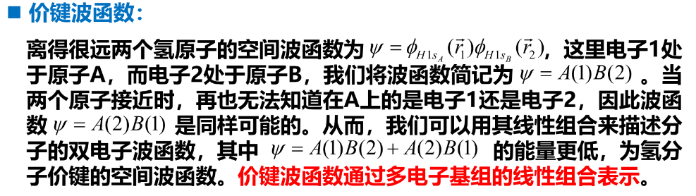
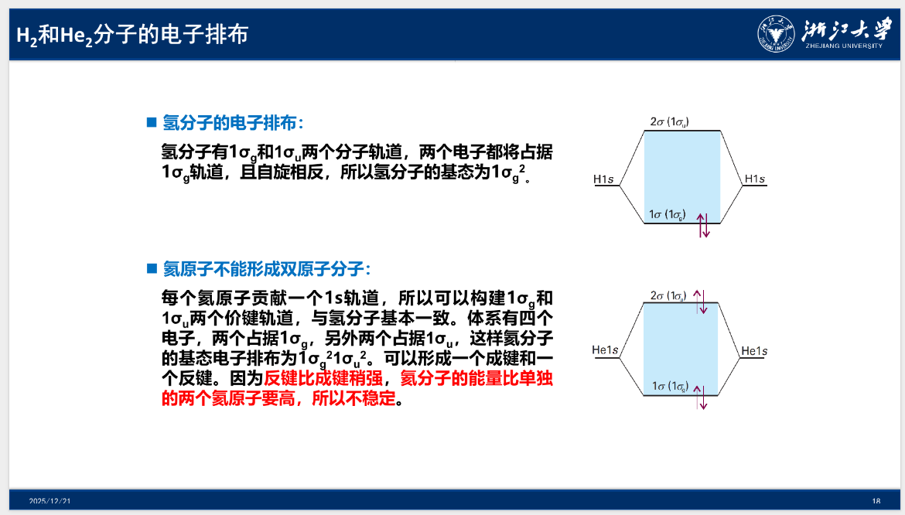
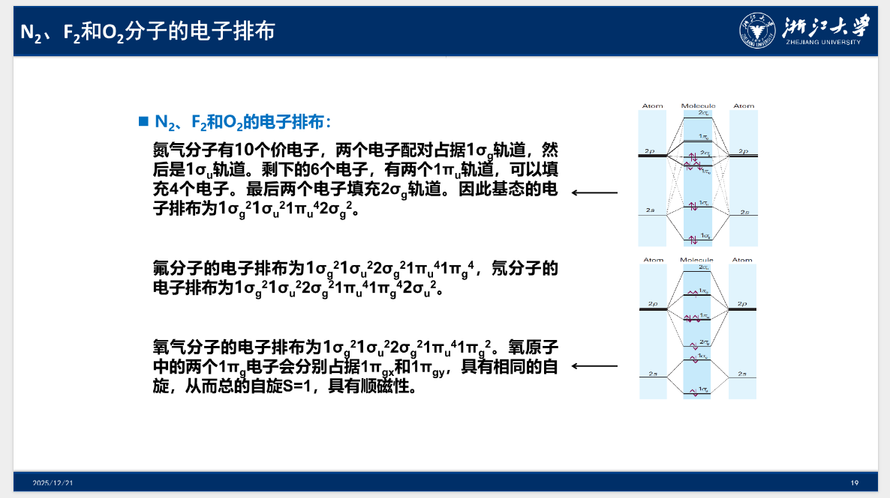

# Chapter 10: 双原子分子与共价键

## 氢分子离子

氢分子离子由两个原子核和一个电子组成，是最简单的分子。

哈密顿量：$\hat{H}=-\frac{\hbar^2\nabla^2}{2m_e}-\frac{e^2}{4\pi\varepsilon_0}\left( \frac{1}{r_1}+\frac{1}{r_2}-\frac{1}{R} \right)$

在玻恩-奥本海默近似下，氢分子离子是单体问题，相当于类氢离子，只是原子核由单个原子核变为两个原子核。

两个氢原子的原子轨道间存在相互作用，共同决定了氢分子离子的电子结构。氢原子的电子基态是1s轨道，最简单的做法是考虑两个氢原子1s轨道间的相互作用来研究两个氢原子的成键。

## 正交二能级系统

哈密顿量和定态薛定谔方程：$\hat{H}=\begin{pmatrix} \varepsilon_1 & V  \\ V & \varepsilon_2 \end{pmatrix}$，$\hat{H}\begin{pmatrix} c_1 \\ c_2 \end{pmatrix}=E\begin{pmatrix} c_1 \\ c_2 \end{pmatrix}$

> 本征能量：
>
> $$
> \begin{aligned}
> & \begin{pmatrix} \varepsilon_1 & V  \\ V & \varepsilon_2 \end{pmatrix} \begin{pmatrix} c_1 \\ c_2 \end{pmatrix} = E \begin{pmatrix} c_1 \\ c_2 \end{pmatrix} \Rightarrow \begin{vmatrix} \varepsilon_1-E & V  \\ V & \varepsilon_2-E \end{vmatrix}=0 \\
> & \Rightarrow (\varepsilon_1-E)(\varepsilon_2-E)-V^2=0 \\
> & \Rightarrow E^2-(\varepsilon_1+\varepsilon_2)E+(\varepsilon_1\varepsilon_2-V^2)=0 \\
> & \Rightarrow E_{\pm}=\frac{(\varepsilon_1+\varepsilon_2)\pm\sqrt{(\varepsilon_1-\varepsilon_2)^2+4V^2}}{2} \\
> & \Rightarrow \begin{cases}
> E_+ + E_-=\varepsilon_1+\varepsilon_2 \\
> E_+ - E_-=2|V|\qquad(\text{if}\quad\varepsilon_1=\varepsilon_2)
> \end{cases}
> \end{aligned}
> $$
>
> **两个本征态的能量之和与原来的两个量子态能量之和相等。**若原来的量子态能量相等，则本征态的能量劈裂为两倍的相互作用。
>
> 我们可以推导出：
>
>$$E_+=\varepsilon_1+V\tan\xi \quad E_-=\varepsilon_2-V\tan\xi \qquad \text{when} \quad \xi=\frac{1}{2}\arctan\frac{2|V|}{\varepsilon_2-\varepsilon_1}$$
>
> 从而我们得到本征态波函数：$\psi_+=\begin{pmatrix} \cos\xi \\ \sin\xi \end{pmatrix} \quad \psi_-=\begin{pmatrix} -\sin\xi \\ \cos\xi \end{pmatrix}$

**量子态间的相互影响：**

二能级系统的本征态由角度 $\xi$ 决定，依赖于原来两个量子态之间的相互作用与能差的比值。若 $|\varepsilon_2-\varepsilon_1| \gg 2|V| \Rightarrow \xi \ll 1 $，则两个本征态几乎与原来的两个量子态相同，即两能级基本不相互影响。

如果原本两个量子态上各有一个电子，根据能量最低原理，二能级相互作用后电子会占据能量更低的本征态 $E$ 。为了尽可能地降低轨道能量，我们需要尽量增强二能级的相互作用 $V$ 。

## 非正交二能级系统

哈密顿量：$\hat{H}=\begin{pmatrix} \alpha_A & \beta \\ \beta & \alpha_B \end{pmatrix}$；重叠矩阵：$\hat{S}=\begin{pmatrix} 1 & S \\ S & 1 \end{pmatrix}$；定态薛定谔方程：$\hat{H}\begin{pmatrix} c_A \\ c_B \end{pmatrix}=E\hat{S}\begin{pmatrix} c_A \\ c_B \end{pmatrix}$

其中，$\alpha$ 称为库伦积分，表示电子占据原子轨道 $A$ 或 $B$ 的能量；$\beta$ 称为转移积分，如果原子轨道间没有交叠，则 $\beta$ 为 0；在平衡键长时，$\beta$ 通常为负值；$S$ 成为重叠积分，不同原子的原子轨道之间非正交，即 $S\ne0$ 。

通过解薛定谔方程，我们可以得到本征值：$E_+=\frac{\alpha+\beta}{1+S},\quad E_-=\frac{\alpha-\beta}{1-S}$；本征态：$\psi_+=\frac{\psi_A+\psi_B}{\sqrt{2(1+S)}},\quad \psi_-=\frac{\psi_A-\psi_B}{\sqrt{2(1-S)}}$

自然我们会希望知道此处所谓的 $\alpha$ 与 $\beta$ 如何计算，现以最简单的氢分子离子为例：

> 1s 轨道的库仑积分：
>
> $$
> \begin{aligned}
> \alpha&=\int\phi_{1s}^{(1)}\hat{H}\phi_{1s}^{(1)}dxdydz=\int\phi_{1s}^{(2)}\hat{H}\phi_{1s}^{(2)}dxdydz\\
> & \quad 此处我们简记 \quad dxdydz \quad 为 \quad dr \\
> \Rightarrow \alpha&=\int\phi_{1s}^{(1)}\left(-\frac{\hbar^2\nabla^2}{2m_e}-\frac{e^2}{4\pi\varepsilon_0r_1}-\frac{e^2}{4\pi\varepsilon_0r_2}+\frac{e^2}{4\pi\varepsilon_0R}  \right)\phi_{1s}^{(1)}dr \\
> &=E_{1s}+J,\qquad J=\frac{e^2}{4\pi\varepsilon_0}\left( 1+\frac{1}{R} \right)e^{-2R}
> \end{aligned}
> $$
>
> 1s 轨道间的共振积分：
>
> $$
> \begin{aligned}
> \beta &= \int\phi_{1s}^{(1)}\hat{H}\phi_{1s}^{(2)}dr = \int\phi_{1s}^{(2)}\hat{H}\phi_{1s}^{(1)}dr \\
> &= \int\phi_{1s}^{(1)}\left(-\frac{\hbar^2\nabla^2}{2m_e}-\frac{e^2}{4\pi\varepsilon_0r_1}-\frac{e^2}{4\pi\varepsilon_0r_2}+\frac{e^2}{4\pi\varepsilon_0R}  \right)\phi_{1s}^{(2)}dr \\
> &= SE_{1s} + K,\qquad K=\frac{e^2}{4\pi\varepsilon_0}\left( \frac{1}{R}-\frac{2R}{3} \right)e^{-R}
> \end{aligned}
> $$
>
> 从中我们可以得到：共振积分与重叠积分线性相关。

将上面我们所得到的 $\alpha$ 与 $\beta$ 代入本征值得：

$$
E_+=\frac{\alpha+\beta}{1+S}=\frac{E_{1s}+J+SE_{1s}+K}{1+S}=E_{1s}+\frac{J+K}{1+S}$$

$$E_-=\frac{\alpha-\beta}{1-S}=E_{1s}+\frac{J-K}{1-S}
$$

两个 1s 原子轨道相互作用产生两个本征态，电子处于**能量较低**的基态上。

相应的势能面在有限的原子间距处存在一个能量极小点，因此是稳定的状态，导致双原子形成分子。

## 成键与反键

**成键轨道：**

键长较大时，键长减小会导致两个原子核的轨道重叠程度增加，能量减小；键长较小时，键长减小反而会引起核与核之间的排斥增大，能量增大。因此，基态势能面存在一个极小值，该电子本征态称为成键轨道。

**反键轨道：**

本征值 $E_-$ 对应的波函数可写作 $\psi_-=N(A-B)$，其中 $N$ 为归一化因子，该波函数当 $A=B$ 时有一个节面，电子概率密度为 $|\psi_-|^2=N^2(A^2+B^2-2AB)$​，由于交叉项的存在，核间电子密度减小，当电子占据该分子本征态时会降低两原子之间的结合力，能量升高，称为反键轨道。

## 价键理论

对于多电子分子，我们需要考虑电子的自旋效应。

一个原子某个原子轨道上的**电子**与另一个原子某个原子轨道上的**电子**通过**自旋配对**形成化学键。**价键理论属于多电子图像。**

**价键波函数：**

{ width="60%" }

**σ 键与 π 键的成键机制：**

波函数叠加使得电子在原子核间有更高的概率，从而将原子核结合得更紧密，称为 σ 键。以两个原子核的连线成旋转对称轴，沿着轴线方向看起来像一对电子占据了 s 轨道，而s在希腊字母里表示为 σ 。在价键理论里，这种方式会带来整体能量的降低。

交换两个电子需要波函数变号，价键波函数应为：

$$
\psi(1,2)=\{ A(1)B(2)+A(2)B(1) \}\sigma_-(1,2)$$

$$\sigma_-(1,2)=\frac{1}{\sqrt{2}}\{\alpha(1)\beta(2)-\alpha(2)\beta(1)\}
$$

在多电子分子中，成键电子的自旋必须配对。

氮原子的价电子为 2s$^2$2p$_\text{x}^1$2p$_\text y^1$2p$_\text z^1$ ，假设 z 轴为核间方向，每个原子都有一个 2p$_\text z$ 轨道指向另一个原子的 2p$_\text z$ 轨道。此时，两个 2p$_\text z$ 轨道可以构建空间波函数 $\psi=A(1)B(2)+A(2)B(1)$ 通过双电子自旋配对成 σ 键。

氮原子的 2p$_\text x$ 和 2p$_\text y$ 轨道都垂直于 z 轴，由于没有核间方向的旋转对称性，无法形成 σ 键，但是可以形成 π 键。π 键也由自旋配对形成，由 p 轨道肩并肩排列。从核间方向看，π 键像一对电子占据了 p 轨道，而 p 在希腊语中表示为 π 。氮气分子中有两个 π 键，一个由 2p$_\text x$ 形成，另一个由 2p$_\text y$​ 形成。

**价键的符号表示：**

1. 按类型与能量分：
   按照能量从低到高将所有的 σ 轨道分别表示为 1σ 、2σ 、3σ 等。
     通常反键用$^*$作为上标，因此对氢分子离子的 2σ 轨道常被记为 2σ$^*$ 。
     对 π 轨道，也可以近似类似地表示。
2. 按价键对称性分：
   波函数按照中心进行翻转不变称为偶对称，由于偶在德语中表示为 gerade ，因此表示为 σ$_\text g$ ；
     如果波函数中心翻转变符号，则称为奇对称，即 ungerade ，因此表示为 σ$_\text u$ 。
     如果将同对称性的进行统一变号，那么 2σ 对应的表示为 1σ$_\text u$​ 。

**原子轨道成键和电子排布规则：**

1. 能量接近原则：
   **较强的成键和反键都需要原子轨道具有接近的能量。**
   同时，虽然内层电子的能量接近，但它们之间的重叠非常小，所以共振积分可以忽略。
   另外，内层和价层轨道间能差很大，通常可以忽略内层电子对成键的贡献。
   对第二周期的元素，只有 2s 和 2p 原子轨道需要考虑。
2. 对称性匹配原则：
   **只有合适对称性的原子轨道可以成键。**
   为了形成 σ 轨道，我们将凡是沿着原子轴间方向具有中心对称性的原子轨道进行线性组合，这些轨道包括 2s 轨道和 2p$_\text z$​​轨道。
3. 分子的电子排布规则：
   能量最低原理、泡利不相容原理、洪特规则

## 同核双原子分子

**σ 轨道：**

$$
\psi(1,2)=c_{A2s}\chi_{A2s}+c_{B2s}\chi_{B2s}+c_{A2p_z}\chi_{A2p_z}+c_{B2p_z}\chi_{B2p_z}
$$

如果 2s 和 2p$_\text{z}$ 能差很大，可以独立进行线性组合，则分离：

$$
\psi(1,2)=c_{A2s}\chi_{A2s}+c_{B2s}\chi_{B2s}\qquad \psi(1,2)'=c_{A2p_z}\chi_{A2p_z}+c_{B2p_z}\chi_{B2p_z}
$$

由于两个原子为同核，相应轨道的能量相等，则：

$$
\psi(1,2)=\chi_{A2s}\pm\chi_{B2s}\qquad \psi(1,2)'=\chi_{A2p_z}\pm\chi_{B2p_z}
$$

以上轨道分别为 1σ$_\text g$ 和 1σ$_\text u$ ，以及 2σ$_\text g$ 和 2σ$_\text u$ 。

**π 轨道：**

我们考虑每个原子的 2p$_\text x$ 和 2p$_\text y$ 轨道。这些轨道垂直于核间的轴，其重叠可以叠加或消减，产生 π 轨道。两个 2p$_\text x$ 轨道产生两个 π$_\text x$ 轨道，而两个 2p$_\text y$ 产生两个 π$_\text y$ 轨道。成键为 π$_\text u$ ，而反键为 π$_\text g$ 。

**以下举出一些同核双原子分子的电子排布：**

{ width="75%" }

{ width="75%" }

**键级：**

双原子分子的键级定义为成键轨道电子数与反键轨道电子书差的一半，即：

$$
b=\frac{1}{2}(n-n^*)
$$

在通常情况下，键级越大，键长越短，解离能越大，键也越强。

## 异核双原子分子

异核分子中原子的吸电子能力不同导致极性键，也就是电子对被两个原子的共享程度不同。

$$
\psi=c_AA+c_BB\qquad(c_A\ne c_B)
$$

纯离子键 $A^+B^-$ 对应于 $c_A=0$ 和 $c_B=1$ 。

例如 HF 分子，成键轨道主要由 F 的 2p 轨道贡献，反键轨道主要由 H 的 1s 轨道贡献。

$$
\psi=c_{H1s}\chi_{H1s}+c_{F2p}\chi_{F2p}
$$
