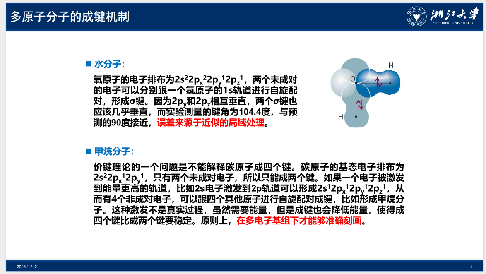
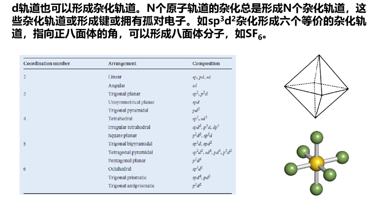

# Chapter 11: 多原子分子轨道理论

## 多原子分子的成键机制

{ width="67%" }

上面的理论表明甲烷分子存在三个同类型的 σ 键，由氢原子的 1s 轨道和碳原子的 2p 轨道形成，而第四个键由氢原子的 1s 轨道和碳原子的 2s 轨道形成。

而杂化轨道理论认为激发的电子和其他电子等价，由碳原子的 2s 和 2p 轨道重新组合形成。

## 杂化轨道理论

### sp$^3$杂化

四个等价的杂化轨道由特殊的线性组合生成：

$$
h_1=s+p_x+p_y+p_z \quad h_2=s-p_x-p_y+p_z \quad h_1=s-p_x+p_y-p_z \quad h_1=s+p_x-p_y-p_z
$$

每个杂化轨道都有一个突出部分，指向正四面体的一个角。杂化涉及一个 s 轨道和三个 p 轨道，所以称为 sp$^3$ 杂化轨道。每个杂化轨道跟一个氢原子的 1s 轨道作用，形成 σ 键。例如：$\psi=h_1(1)A(2)+h_1(2)A(1)$。这种键比通常的 s 和 p 轨道成键要强。

### sp$^2$杂化

乙烯分子是平面分子，有一个刚性的双键。我们将碳原子激发为 2s$^1$2p$^3$，并杂化产生轨道：

$$
h_1=s+\sqrt{2}p_y \quad h_2=s+\sqrt{3/2}p_x-\sqrt{1/2}p_y \quad h_3=s-\sqrt{3/2}p_x-\sqrt{1/2}p_y
$$

这些轨道在一个等边三角形面内，指向三个顶点。第三个 2p 轨道不参与杂化，垂直于平面。在所有杂化轨道中，s 和 p 轨道的比重都是 1:2 。三个 sp$^2$ 杂化轨道分别与另一个碳原子或氢原子 1s 轨道配对，形成 σ 键，夹角为 120 度。当两个 $\ce{CH2}$基团在同一平面内时，两个未杂化的 p 轨道作用配对，形成 π 键，将分子锁定为平面。$\ce{CH2}$​的任何旋转都会减弱 π 键，从而增大分子能量。

### sp 杂化

乙炔是一个线性分子，sp 杂化轨道定义为：

$$
h_1=s+p_z\quad h_2=s-p_z
$$

这两个杂化轨道沿着核间轴方向。与另一个碳原子相应的杂化轨道或者氢原子的 1s 轨道进行自旋配对成键。剩余的两个 p 轨道垂直于分子线，形成两个相互垂直的 π 键。

### 其他杂化轨道

{ width="67%" }

## 分子轨道理论

分子轨道理论认为电子不属于一个特定的化学键，而是离域在整个分子中。从某种程度上讲，杂化轨道理论是分子轨道理论的简化近似理论。相对于价键理论，分子轨道理论发展得更为完善，被广泛用于现代化学中的各种问题研究。

**分子轨道理论属于近似单电子图像。**

**平均场近似：**

对氢分子离子，由于只有一个电子，分子轨道通过直接求解不含时薛定谔方程得到，类似于原子轨道，只是离域在分子中。对更复杂的分子，需要引入平均场近似，通过迭代得到单电子哈密顿量，进而进行分子轨道计算。

**基于平均场近似的Hartree-Fock分子轨道理论是现代量子化学的基石，后续发展的Post-Hartree-Fock理论超越分子轨道理论，在多电子图像下研究分子，是更为精确的理论。**

**原子轨道线性组合：**

$$
\psi=\sum_i c_i\chi_i
$$

将分子轨道波函数表达为各原子轨道的线性组合，通过Hartree-Fock方法求解单电子薛定谔方程，可以得到分子轨道系数和能量。多原子分子的分子轨道表现出比双原子分子更多样化的轨道形状。

下面我们给出普适分子的定态薛定谔方程：

$$
\left( \sum_i\frac{-\hbar^2\nabla_i^2}{2m_e}+\sum_{i<j}\frac{e^2}{4\pi\varepsilon_0|\vec{r}_i-\vec{r}_j|}+\sum_i\frac{-Ze^2}{4\pi\varepsilon_0|\vec{r}_i-\vec{R}|} \right)\psi(\{\vec{r}_i\})=E\psi(\{\vec{r}_i\})
$$

在平均场近似下，可以转化为单电子的定态薛定谔方程：

$$
\pmb{\text{F}}(r_1)\ket{\psi(r_i)}=\varepsilon\ket{\psi(r_1)}\qquad\qquad\pmb{\text{F}}(r_1)=\pmb{\text{h}}(r_1)+\sum_k\left[ \pmb{\text{j}}_k(r_1)-\pmb{\text{k}}_k(r_1) \right]
$$

其中，$\pmb{\text{F}}$ 为 Fock 算符，$\pmb{\text{h}}$ 为单电子算符，$\pmb{\text{j}}_k$ 为库仑积分算符，$\pmb{\text{k}}_k$ 为交换积分算符。薛定谔方程通过将 $\psi=\sum_ic_i\chi_i$ 代入求解，得到所有的分子轨道。

## 休克尔近似

**前线分子轨道理论：**

1951年，福井谦一提出前线分子轨道理论，用于解释分子成键。能量上最高占据分子轨道 ( Highest Occupied Molecular Orbital, HOMO ) 和最低未占据分子轨道 ( Lowest Unoccupied Molecular Orbital, LUMO ) 是决定了分子发生反应的关键，对谱学性质有重要贡献，被称为前线轨道。HOMO 与 LUMO 的能差为能隙。

**休克尔分子轨道近似：**

1931年，休克尔指出对共轭分子，在一个碳链上具有单双键交替，π 分子轨道可以通过一系列休克尔近似方法进行处理。π 轨道独立于 σ 轨道，后者构成刚性骨架，决定分子的基本形状。只考虑对 π 轨道贡献的碳原子 2p$_\text z$​ 原子轨道，以及这些原子轨道之间的相互作用。

休克尔近似遵循以下原则：

1. 所有不同原子轨道间的重叠积分设为零，即 $S=0$​ 。
2. 所有非近邻原子间的转移积分为零，即对于两个非直接相连的原子，$\beta=0$​ 。
3. 成键原子间的转移积分相等，约-2.4eV。

通过对分子上的碳原子标号，我们可以写出分子的休克尔分子轨道的哈密顿量：在矩阵主对角线上为 $\alpha$ ，在与本原子相连的碳处为 $\beta$ 。通过解其薛定谔方程，我们可以得到各本征态的能量。

> 例 1 ：乙烯的休克尔分子轨道
>
> $$
> \hat{H}=
> \begin{pmatrix}
> \alpha & \beta \\
> \beta & \alpha
> \end{pmatrix}
> \qquad
> \hat{H}\psi=E\psi \Rightarrow
> \begin{vmatrix}
> \alpha-E & \beta \\
> \beta & \alpha-E
> \end{vmatrix}=0
> $$
>
> 例 2 ：丁二烯的休克尔分子轨道：
>
> $$
> \begin{aligned}
> &\hat{H}=
> \begin{pmatrix}
> \alpha & \beta & 0 & 0 \\
> \beta & \alpha & \beta & 0 \\
> 0 & \beta & \alpha & \beta \\
> 0 & 0 & \beta & \alpha \\
> \end{pmatrix}
> \qquad
> 薛定谔方程为:HC=EC \\
> \Rightarrow
> &本征值矩阵:E=
> \begin{pmatrix}
> \alpha+1.62\beta & 0 & 0 & 0 \\
> 0 & \alpha+0.62\beta & 0 & 0 \\
> 0 & 0 & \alpha-0.62\beta & 0 \\
> 0 & 0 & 0 & \alpha-1.62\beta \\
> \end{pmatrix}\\
> &本征态矩阵:C=
> \begin{pmatrix}
> 0.372 & 0.602 & 0.602 & -0.372 \\
> 0.602 & 0.372 & -0.372 & 0.602 \\
> 0.602 & -0.372 & -0.372 & -0.602 \\
> 0.372 & -0.602 & 0.602 & 0.372 \\
> \end{pmatrix}\\
> \end{aligned}
> $$

**π 电子结合能、π 电子离域化能、π 键形成能：**

π 电子结合能是所有π 电子能量之和。对于丁二烯分子，有四个 π 电子，电子排布为 1π$^2$2π$^2$ 。前线轨道 HOMO 为 2π ，LUMO为 3π 。$E_\pi=2(\alpha+1.62\beta)+2(\alpha+0.62\beta)=4\alpha+4.48\beta$

对于乙烯分子，π 电子结合能为 $E_\pi=2\alpha+2\beta$ 。丁二烯的能量比两个独立的 π 键低 $0.48β$​ 。共轭体系这种额外的稳定性称为离域化能。

也可以定义π键形成能为 $E_{bf}=E_\pi-N\alpha$ ，$N$ 是分子中碳原子的数目。对于丁二烯，π 键形成能为 $4.48β$ 。

上述的例子为线状分子，类似地我们也可以得到环状分子在休克尔近似下的哈密顿量。

> 例 3 ：环丁二烯
>
> $$
> \hat{H}=
> \begin{pmatrix}
> \alpha & \beta & 0 & \beta \\
> \beta & \alpha & \beta & 0 \\
> 0 & \beta & \alpha & \beta \\
> \beta & 0 & \beta & \alpha \\
> \end{pmatrix} \\$$
>
> $$E=\alpha+2\beta,\alpha,\alpha,\alpha-2\beta \quad E_\pi=2(\alpha+2\beta+\alpha)=4\alpha+4\beta
> $$
>
> 环丁二烯的离域化能为 0 ，分子不稳定。
>
> 例 4 ：苯
>
> $$
> \hat{H}=
> \begin{pmatrix}
> \alpha & \beta & 0 & 0 & 0 & \beta \\
> \beta & \alpha & \beta & 0 & 0 & 0 \\
> 0 & \beta & \alpha & \beta & 0 & 0 \\
> 0 & 0 & \beta & \alpha & \beta & 0 \\
> 0 & 0 & 0 & \beta & \alpha & \beta \\
> \beta & 0 & 0 & 0 & \beta & \alpha \\
> \end{pmatrix} \\$$
>
> $$E=\alpha\pm2\beta,\alpha\pm\beta,\alpha\pm\beta \quad E_\pi=2(\alpha+2\beta)+4(\alpha+\beta)=6\alpha+8\beta
> $$
>
> 苯的离域化能为 $2β$ ，比丁二烯要高很多。
