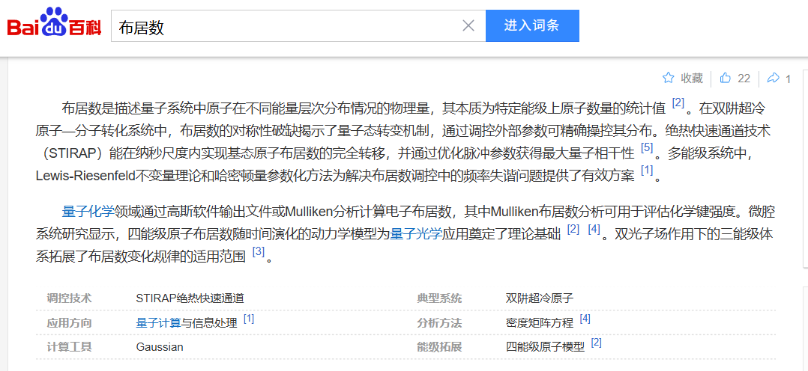
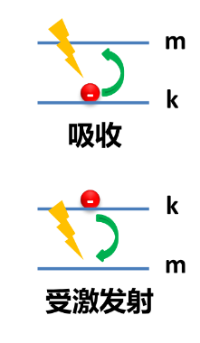
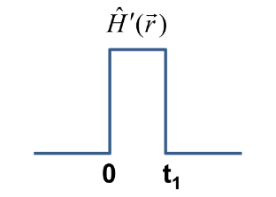
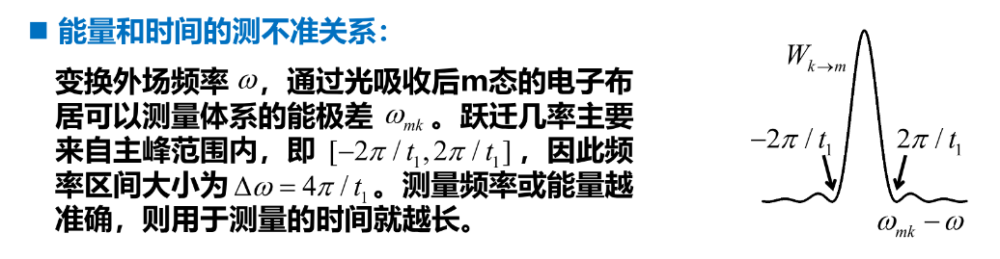
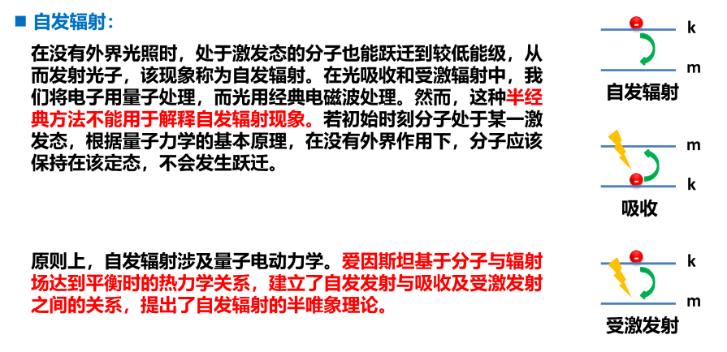

# Chapter 12: 电子跃迁与含时微扰

## 分子-电磁场相互作用

电磁波与分子相互作用，导致电子在量子化的能级间进行跃迁，并导致光的吸收和发射，电子跃迁与光谱紧密关联。

磁场与电子磁矩的相互作用可以忽略，分子周围的电场可以假设为均匀电场。

**电偶极与电场相互作用：**

偶极矩：$\mu_z=\sum_i q_i z_i \Rightarrow |\mu_z|=ql$

含时电场：$E(t)=E\cos \omega t$

相互作用哈密顿量：$\hat{H}'(t)=-\sum_i q_i E(t) z_i = -\mu_z E \cos \omega t$​

电磁场作用于分子是电子偶极矩与震荡的电场之间的相互作用。

**能级间的电子动力学：**

在电磁场中，如果电子初始处于 k 态，计算m态上的电子布居随时间的变化可以得到其跃迁速率。

{ width="67%" }

如果 $E_k<E_m$ ，该速率对应光吸收；如果 $E_k>E_m$ 则对应受激发射。

{ width="20%" }

**含时动力学计算：**

初始波函数：$\psi(0)=\phi_k$

含时哈密顿量：$\hat{H}=\hat{H}_0+\hat{H}'(t)\qquad \hat{H}'(t)=\begin{cases} 0 \qquad \quad \ {} \ {} \ {} \qquad t<0 \\ -\mu_zE\cos\omega t \quad t\ge0 \end{cases}$

含时薛定谔方程：$\frac{\partial\psi(t)}{\partial t}=\frac{\hat{H}(t)\psi(t)}{i\hbar}$

假设 $\hat{H}'(t)$ 相对于 $\hat{H}_0$ 是小量，可以使用含时微扰理论近似计算。

## 含时微扰理论

**基本思路：**

基于非微扰哈密顿量的本征态，近似计算微扰存在时的含时波函数。

体系的哈密顿量为 $\hat{H}=\hat{H}_0+\hat{H}'(t)$ ，含时薛定谔方程为 $i\hbar\frac{\partial}{\partial t}\Psi(t)=\hat{H}(t)\Psi(t)$

代入得到非微扰部分的定态薛定谔方程：$\hat{H}_0\psi_n=\varepsilon_n\psi_n$

定义含时基组：

$$
\left.
\begin{aligned}
&\Psi_n(0)=\psi_n \\
&i\hbar\frac{\partial}{\partial t}\Psi_n(t)=\hat{H}_0\Psi_n(t)
\end{aligned}
\right\}\Rightarrow \Psi_n(t)=\psi_ne^{-i\varepsilon_nt/\hbar}
$$

进而我们得到含时波函数的基组展开形式：$\Psi(t)=\sum_na_n(t)\Psi_n(t)$

> 含时波函数系数的演化方程：
>
> $$
> \begin{aligned}
> & i\hbar\frac{\partial}{\partial t}\left( \sum_n a_n(t)\Psi_n \right) = \hat{H}(t)\left( \sum_n a_n(t)\Psi_n \right) \\
> & \Rightarrow i\hbar\sum_n\frac{\partial a_n(t)}{\partial t}\Psi_n + \sum_n a_n(t) \left(i\hbar\frac{\partial \Psi_n}{\partial t} \right)=\left(\hat{H}_0+\hat{H}'(t)\right)\left( \sum_n a_n(t)\Psi_n \right) \\
> & \Rightarrow i\hbar\sum_n\frac{\partial a_n(t)}{\partial t}\Psi_n + \sum_n a_n(t) \hat{H}_0\Psi_n=\left(\hat{H}_0+\hat{H}'(t)\right)\left( \sum_n a_n(t)\Psi_n \right) \\
> & \Rightarrow i\hbar\sum_n\frac{\partial a_n(t)}{\partial t}\Psi_n=\hat{H}'(t)\left( \sum_n a_n(t)\Psi_n \right) \\
> & \Rightarrow i\hbar\sum_n\frac{\partial a_n(t)}{\partial t}\int\Psi_m^*\Psi_ndr=\sum_n a_n(t)\left( \int\Psi_m^*\hat{H}'(t)\Psi_ndr \right) \\
> & \Rightarrow i\hbar\sum_n\frac{\partial a_n(t)}{\partial t}\delta_{mn}=\sum_n a_n(t)\left( \int\psi_m^*\hat{H}'(t)\psi_ndr \right)e^{i(\varepsilon_m-\varepsilon_n)t/\hbar} \\
> & \Rightarrow i\hbar\frac{\partial a_m(t)}{\partial t}=\sum_n a_n(t)H'_{mn}e^{i\omega_{mn}t} \\
> & 其中 H'_{mn}=\int\psi_m^*\hat{H}'(t)\psi_nd\tau \qquad \omega_{mn}=\frac{\varepsilon_m-\varepsilon_n}{\hbar}
> \end{aligned}
> $$
>
> **注意结果中 $LHS$ 为 $a_m(t)$ ，$RHS$ 为 $a_n(t)$ 。**

**含时波函数系数的近似演化：**

1. 引入一个参数 $\lambda \in [0,1]$ ，用 $\lambda\hat{H}'$ 代替 $\hat{H}'$ ；
2. 将 $a_n(t)$ 展开成幂级数形式： $a_n(t)=a_n^{(0)}(t)+\lambda a_n^{(1)}(t)+\lambda^2 a_n^{(2)}(t)+\dots$ ；
3. 将上式代入含时波函数系数的演化方程：

$$
i\hbar\left[ \frac{\partial a_m^{(0)}}{\partial t} + \lambda \frac{\partial a_m^{(1)}}{\partial t} + \lambda^2\frac{\partial a_m^{(2)}}{\partial t} + \dots \right] = \sum_n \left[ a_n^{(0)}+\lambda a_n^{(1)}+\lambda^2 a_n^{(2)}+\dots \right]\lambda H'_{mn}e^{i\omega_{mn}t}
$$

4. 按 $\lambda$ 的幂次展开分类，整理得到各级运动方程：

$$
\frac{\partial a_m^{(0)}}{\partial t}=0 \qquad i\hbar\frac{\partial a_m^{(1)}}{\partial t}=\sum_na_n^{(0)}H'_{mn}e^{i\omega_{mn}t} \qquad i\hbar\frac{\partial a_m^{(2)}}{\partial t}=\sum_na_n^{(1)}H'_{mn}e^{i\omega_{mn}t}
$$

5. 令 $\lambda=1$ ，可以得到含时波函数 $\Psi$ 的各级近似解。

**线性含时微扰：**

假设 $t\le0$ 时，体系处于 $\hat{H}_0$ 的第 $k$ 个本征态 $\psi_k$ 。

$$
\begin{aligned}
& \psi_k = \sum_n a_n(0)\Psi_n(0) = \sum_n\left[ a_n^{(0)}+\lambda a_n^{(1)}+\lambda^2 a_n^{(2)}+\dots \right] \psi_n \\
& \Rightarrow \begin{cases}
a_n^{(0)}(0)=\delta_{nk} \\
a_n^{(1)}(0)=a_n^{(2)}(0)=\dots=0
\end{cases}
\end{aligned}
$$

因为 $a_n^{(0)}(0)$ 不随时间变化，所以 $a_n^{(0)}(t)=a_n^{(0)}(0)=\delta_{nk}$

$t>0$ 后加入微扰，则第一阶近似或线性含时微扰为：

$$
i\hbar\frac{\partial a_m^{(1)}(t)}{\partial t} = \sum_n a_n^{(0)} H'_{mn} e^{i\omega_{mn}t} = H'_{mk} e^{i\omega_{mk}t} \Rightarrow a_m^{(1)}(t) = \frac{1}{i\hbar}\int_0^t H'_{mk} e^{i\omega_{mk}t'}dt'
$$

**量子跃迁几率：**

含时波函数：$\Psi(t)=\sum_m a_m(t) \Psi_m(t)$

波函数系数：$a_n(t)=a_n^{(0)}(t)+a_n^{(1)}(t)+a_n^{(2)}(t)+\dots=\delta_{mk}+\frac{1}{i\hbar}\int_0^t H'_{mk} e^{i\omega_{mk}t'}dt'+\dots$

若末态 m 不等于初态 k 时，$a_m(t)=\frac{1}{i\hbar}\int_0^t H'_{mk} e^{i\omega_{mk}t'}dt'+\dots$

在微扰作用下，$t$ 时刻体系处于末态 $\Psi_m$ 的几率为：

$$
W_{k\to m}(t)=|a_m(t)|^2 \approx \left|\frac{1}{i\hbar}\int_0^t H'_{mk} e^{i\omega_{mk}t'}dt'\right|^2
$$

跃迁速率为：$\omega_{k \to m}=\frac{dW_{k \to m}}{dt}$​

## 有限时间常微扰

**含时哈密顿量：**

$\hat{H}'=\begin{cases} 0 \qquad\qquad t<0 \\ \hat{H}'(\vec{r}) \qquad 0 \le t \le t_1 \\ 0 \qquad\qquad t>t_1 \end{cases}$

{ width="20%" }

**线性含时微扰：**

如果 $t=t_1$​

$$
\begin{aligned}
W_{k\to m}(t)
&= \left|\frac{1}{i\hbar}\int_0^t H'_{mk} e^{i\omega_{mk}t'}dt'\right|^2
= \left|\frac{1}{i\hbar}\int_0^{t_1} H'_{mk} e^{i\omega_{mk}t}dt\right|^2
= \left|\frac{H'_{mk}}{i\hbar}\int_0^{t_1}  e^{i\omega_{mk}t}dt\right|^2 \\
&= \left|\frac{H'_{mk}}{i\hbar} \frac{1}{i\omega_{mk}} \left.e^{i\omega_{mk}t}\right|_0^{t_1} \right|^2
= \left|\frac{H'_{mk}}{-\hbar\omega_{mk}} \left(e^{i\omega_{mk}t_1}-1\right) \right|^2 \\
&= \left|\frac{H'_{mk}}{-\hbar\omega_{mk}} e^{i\omega_{mk}t_1/2} \left(e^{i\omega_{mk}t_1/2}-e^{-i\omega_{mk}t_1/2}\right) \right|^2
= \left|\frac{H'_{mk}}{-\hbar\omega_{mk}} 2i e^{i\omega_{mk}t_1/2} \sin\left(\omega_{mk}t_1/2\right) \right|^2 \\
&= \frac{4 \left|H'_{mk} \right|^2 \sin^2\left(\omega_{mk}t_1/2\right)}{\hbar^2 \omega_{mk}^2} \\
& \Rightarrow W_{k\to m}(t_1) = \frac{4 \left|H'_{mk} \right|^2 \sin^2\left(\omega_{mk}t_1/2\right)}{\hbar^2 \omega_{mk}^2}
\end{aligned}
$$

## 费米黄金规则

**长时间极限的跃迁速率：**

我们已知：

$$
\lim_{\alpha \to \infty} \frac{\sin^2 (\alpha x)}{\pi \alpha x^2}=\delta(x)
$$

则代入 $x=\omega_{mk}/2,\alpha=t_1$ 得：

$$
\begin{aligned}
& \lim_{t_1 \to \infty}\frac{\sin^2 \left( \omega_{mk}t_1/2 \right)}{\omega^2_{mk}t_1/4}
= \pi \delta(\omega_{mk}/2)=2\pi\hbar\delta(\varepsilon_m-\varepsilon_k) \\
\Rightarrow & \lim_{t_1 \to \infty} W_{k \to m} = \frac{t_1 \left|H'_{mk} \right|^2}{\hbar^2} \lim_{t_1 \to \infty} \frac{\sin^2 \left( \omega_{mk}t_1/2 \right)}{\omega^2_{mk}t_1/4}
= \frac{2\pi t_1}{\hbar} \left|H'_{mk} \right|^2 \delta(\varepsilon_m-\varepsilon_k) \\
\Rightarrow & \omega_{k \to m} = \frac{dW_{k \to m}}{dt} = \frac{2\pi}{\hbar} \left|H'_{mk} \right|^2 \delta(\varepsilon_m-\varepsilon_k)
\end{aligned}
$$

这说明：速率与时间无关，**只有在初态能量小范围内才有跃迁几率**。

**费米黄金规则：**

体系在 $\varepsilon_m$ 附近 $d\varepsilon_m$ 范围内的态数目是 $\rho(\varepsilon_m)d\varepsilon_m$ ，则总跃迁速率为：

$$
\begin{aligned}
\omega &= \int \rho(\varepsilon_m) \omega_{k \to m} d\varepsilon_m
= \int \rho(\varepsilon_m) \frac{2\pi}{\hbar} \left|H'_{mk} \right|^2 \delta(\varepsilon_m-\varepsilon_k) d\varepsilon_m \\
&=\frac{2\pi}{\hbar} \left|H'_{mk} \right|^2 \int \delta(\varepsilon_m - \varepsilon_k) \rho(\varepsilon_m) d\varepsilon_m
= \frac{2\pi}{\hbar} \left|H'_{mk} \right|^2 \rho(\varepsilon_k)
\end{aligned}
$$

## 跃迁偶极

$$
\begin{aligned}
&\begin{cases}
\omega_{k \to m} = \frac{2\pi}{\hbar} \left|H'_{mk} \right|^2 \delta(\varepsilon_m-\varepsilon_k) \propto \left|H'_{mk} \right|^2 \\
\hat{H}'=-\mu_z E
\end{cases}\\
&\Rightarrow \omega_{k \to m} \propto \left|\mu_{z,mk} \right|^2 E^2
\end{aligned}
$$

电子的跃迁速率正比于电场的平方，也正比于电场方向跃迁偶极的平方。

**其跃迁偶极的定义为：**

$$
\begin{aligned}
& \mu_{mk}=\int \psi_m^* \hat{\mu} \psi_k dr = \int \psi_m^* e \vec{r} \psi_k dr = e \int \psi_m^* \vec{r} \psi_k dr \\
& \mu_{z,mk} = e \int \psi_m^* z \psi_k dr
\end{aligned}
$$

其中，$\int \psi_m^* \vec{r} \psi_k dr$ **与宇称相关，与偶极矩截然不同**。

跃迁偶极与通常的电偶级不同，由两个电子态共同决定。

入射光的吸收强度对应于电子的跃迁速率，因此也正比于跃迁偶极的平方。

## 周期微扰

**含时哈密顿量：**

$$
\hat{H}'=\begin{cases}
0 \qquad\qquad t<0 \\
A\cos\omega t \quad t>0
\end{cases}\quad\Rightarrow\quad
\hat{H}'\equiv\begin{cases}
0 \qquad\qquad\qquad\qquad t<0 \\
F(\vec{r})(e^{i\omega t}+e^{-i\omega t}) \quad t>0
\end{cases}
$$

**含时波函数：**

$$
\begin{aligned}
\hat{H}'_{mk}&=\int\phi_m^*\hat{H}'(t)\phi_kdr\\
&=\int\phi_m^*F(e^{i\omega t}+e^{-i\omega t})\phi_kdr\\
&= \int\phi_m^*F\phi_kdr(e^{i\omega t}+e^{-i\omega t})\\
&=F_{mk}(e^{i\omega t}+e^{-i\omega t})
\end{aligned}
\qquad\qquad\qquad
\begin{aligned}
a_m^{(1)}(t) &= \frac{F_{mk}}{i\hbar} \int_0^t \left( e^{i\omega t'}+e^{-i\omega t'} \right) e^{i\omega_{mk}t'}dt' \\
&= \frac{F_{mk}}{i\hbar} \int_0^t \left( e^{i(\omega_{mk}+\omega) t'}+e^{i(\omega_{mk}-\omega) t'} \right) dt' \\
&= \frac{F_{mk}}{i\hbar} \left. \left[ \frac{e^{i(\omega_{mk}+\omega) t'}}{i(\omega_{mk}+\omega)}+\frac{e^{i(\omega_{mk}-\omega) t'}}{i(\omega_{mk}-\omega)} \right] \right|_0^t \\
&= -\frac{F_{mk}}{\hbar} \left[ \frac{e^{i(\omega_{mk}+\omega) t}-1}{\omega_{mk}+\omega}+\frac{e^{i(\omega_{mk}-\omega) t}-1}{\omega_{mk}-\omega} \right]  \\
\end{aligned}
$$

**频率与波函数演化：**

$$
\begin{cases}
\lim_{\omega \to \omega_{mk}} \frac{e^{i(\omega_{mk}-\omega) t}-1}{\omega_{mk}-\omega} = it \Rightarrow \lim_{\omega \to \omega_{mk}} a_m^{(1)}(t)=-\frac{F_{mk}}{\hbar}\left( \frac{e^{2i\omega_{mk}t}-1}{2\omega_{mk}}+it \right) \\
\lim_{\omega \to -\omega_{mk}} \frac{e^{i(\omega_{mk}+\omega) t}-1}{\omega_{mk}+\omega} = it \Rightarrow \lim_{\omega \to -\omega_{mk}} a_m^{(1)}(t)=-\frac{F_{mk}}{\hbar}\left( \frac{e^{2i\omega_{mk}t}-1}{2\omega_{mk}}+it \right) \\
\end{cases}
$$

这两个极限下，波函数系数有一个随时间线性增加的项，起主要作用。

$$
a_m^{(1)}(t)=-\frac{F_{mk}}{\hbar}\left[ \frac{e^{i(\omega_{mk}+\omega) t}-1}{\omega_{mk}+\omega} + \frac{e^{i(\omega_{mk}-\omega) t}-1}{\omega_{mk}-\omega} \right]
$$

对 $\omega \ne \pm \omega_{mk}$ ，波函数系数是一个周期性振荡函数。

**共振跃迁：**

仅当外界微扰含有频率 $\omega_{mk}$ 时，体系才能从 k 态跃迁到 m 态，这时体系吸收或发射光的能量是 $\hbar \omega_{mk}$ 。

**长时极限的吸收和发射跃迁速率：**

当 $\omega \to \omega_{mk}$ 时，$a_m^{(1)}(t) \approx \left[ \frac{e^{i(\omega_{mk}-\omega) t}-1}{\omega_{mk}-\omega} \right]$ ，另一项起次要作用。

此式与常微扰的表达式类似，只需做代换：$H'_{mk} \rightarrow F_{mk}\quad \omega_{mk} \rightarrow \omega_{mk}-\omega$

因此周期微扰情况下的跃迁几率为：$W_{k \to m} \approx \frac{2\pi t}{\hbar} \left|F_{mk} \right|^2 \delta(\varepsilon_m-\varepsilon_k-\hbar\omega)$

同理，当 $\omega \to -\omega_{mk}$ 时，$W_{k \to m} \approx \frac{2\pi t}{\hbar} \left|F_{mk} \right|^2 \delta(\varepsilon_m-\varepsilon_k+\hbar\omega)$

两式合起来为：

$$
\begin{aligned}
W_{k \to m} &\approx \frac{2\pi t}{\hbar} \left|F_{mk} \right|^2 \delta(\varepsilon_m-\varepsilon_k \pm \hbar\omega) \\
\Rightarrow \omega_{k \to m} &= \frac{2\pi}{\hbar} \left|F_{mk} \right|^2 \delta(\varepsilon_m-\varepsilon_k\pm\hbar\omega)= \frac{2\pi}{\hbar^2} \left|F_{mk} \right|^2 \delta(\omega_{mk}\pm\omega) \\
\Rightarrow \omega_{k \to m} &= \omega_{m \to k}
\end{aligned}
$$

## 有限时间周期外场

**含时哈密顿量：**

$$
\hat{H}'=\begin{cases}
0 \qquad\qquad\qquad\qquad t<0 \\
F(\vec{r})(e^{i\omega t}+e^{-i\omega t}) \quad 0<t<t_1 \\
0 \qquad\qquad\qquad\qquad t>t_1 \\
\end{cases}
$$

**跃迁几率：**

$$
W_{k \to m}(t_1)=\frac{4\left| F_{mk} \right|^2 \sin^2\left[ (\omega_{mk}-\omega)t_1/2 \right] }{\hbar^2(\omega_{mk}-\omega)^2}
$$

{ width="67%" }

## 自发辐射

{ width="67%" }