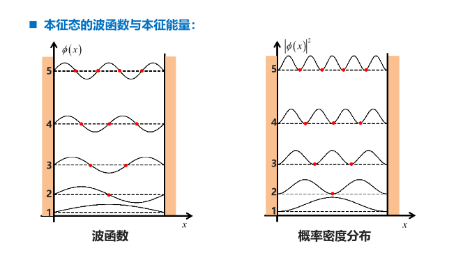
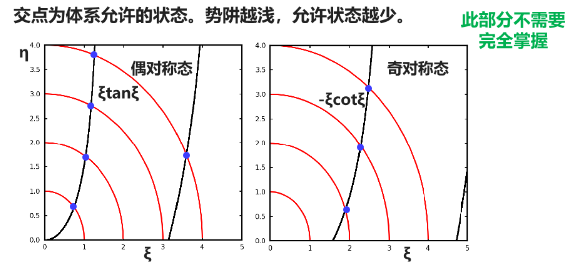
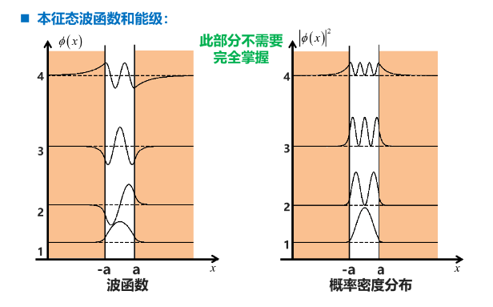
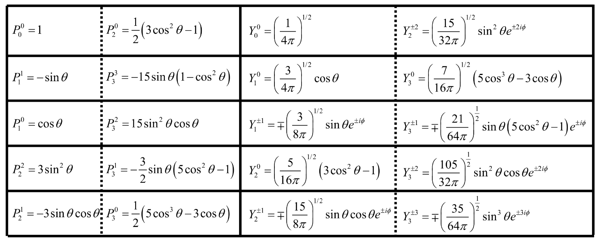
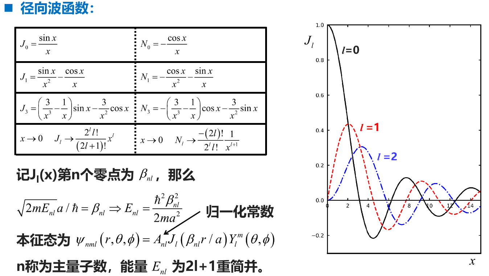

# 箱中粒子与能级

## 一维无限深方势阱

哈密顿量：$\hat{H}=-\frac{\hbar^2}{2m}\frac{\partial^2}{\partial x^2}+V(x)$，$V(x)=\begin{cases} 0,x\in(0,a) \\\infty,otherwise \end{cases}$ $\leftarrow$ 最简单的束缚态问题

定态薛定谔方程：$\left[-\frac{\hbar^2}{2m}\frac{\partial^2}{\partial x^2}+V(x)\right]\phi(x)=E\phi(x)\Rightarrow\frac{\partial^2}{\partial x^2}\phi(x)=\frac{2m}{\hbar^2}\left(V(x)-E \right)\phi(x)$

势阱外的势能无穷大，粒子不能穿过势阱壁，根据波函数的统计诠释有边界条件：$\phi(0)=\phi(a)=0$。

在方势阱内部，$\frac{\partial^2}{\partial x^2}\phi(x)=-\frac{2mE}{\hbar^2}\phi(x)\equiv-k^2\phi(x)$，其中 $k=\frac{\sqrt{2mE}}{\hbar},E=\frac{\hbar^2k^2}{2m}$。

> 对于形如 $\frac{d^2y}{dx^2}+k^2y=0$ 的二阶微分方程，有通解 $\color{blue}y=A\sin kx+B\cos kx$。
>
> 代入边界条件，有：
>
> $$
> \begin{aligned}
> &\begin{cases}
> \phi(0)= 0\Rightarrow B = 0 \\
> \phi(a)= 0\Rightarrow A\sin ka+B\cos ka = 0
> \end{cases}\\
> &\Rightarrow A\sin ka = 0\quad(A\neq 0, otherwise\ \phi\equiv0)\\
> &\Rightarrow ka = n\pi, where\ n = 0,\pm1,\pm2,\dots\\
> &\Rightarrow k =\frac{n\pi}{a}
> \end{aligned}
> $$

所以本征态为 $\phi_n(x)=A\sin\frac{n\pi}{a}x$，本征能量为 $E_n=\frac{n^2\pi^2\hbar^2}{2ma^2},n=0\pm1,\pm2,\dots$

> **一些讨论：**
>
> 1. 当 $n=0$ 时，$\phi_n(x)\equiv0$，此时粒子总概率为 0，波函数没有意义。
>
> 2. 由于 $\sin(-x)=-\sin(x)$，所以 $n$ 为负数时的波函数与相应正数的波函数本质上相同，相差常因子 -1，可以只考虑 $n$ 为正数的情形，即 $\phi_n=A\sin\frac{n\pi}{a}x, n=1,2,\dots$
>
> 3. 本征态的波函数需要进行归一化，从而可以确定系数 $A$。
>
> $$
> \begin{aligned}
> &\int_{-\infty}^{+\infty}|\phi(x)|^2dx =\int_0^a|\phi(x)|^2dx = A^2\int_0^a\sin^2\frac{n\pi x}{a}dx =\frac{1}{2}A^2\int_0^a\left( 1-\cos\frac{2n\pi x}{a} \right)dx = A^2\frac{a}{2}= 1\\
> & \Rightarrow A =\sqrt{\frac{2}{a}} \Rightarrow \phi_n(x)=\sqrt{\frac{2}{a}}\sin\frac{n\pi}{a}x,\quad E_n =\frac{n^2\pi^2\hbar^2}{2ma^2},\quad n = 1,2,\dots \\
> \end{aligned}
> $$

**本征态的波函数与本征能量：**

> 本征态性质：
>
> 1. 当 $n$ 为奇数/偶数时，波函数关于 $x=a/2$ 对称/反对称。
> 2. 若不考虑边界，第 $n$ 个本征态的波函数有 $n-1$ 个节点。
> 3. 体系的最低能量不为 0，而是 $\hbar^2\pi^2/2ma^2$，这一能量称为零点能。
> 4. 本征能量表现为离散的能级，且 $E \propto n^2$，能量越高，能级越稀疏。
> 5. 本征态之间具有正交归一性，任意波函数可以用本征态线性展开。
>
> $$
> \begin{aligned}
> &\int_0^a\phi_m^*(x)\phi_n(x)dx =\frac{2}{a}\int_0^a\sin(m\pi x/a)\sin(n\pi x/a)dx =\delta_{mn}\Rightarrow \braket{\phi_m|\phi_n}=\delta_{mn} \\
> &\psi(x)=\sum_{n = 1}^{\infty}c_n\phi_n(x) \sqrt{\frac{2}{a}}\sum_{n = 1}^{\infty}c_n\sin\left( \frac{n\pi}{a}x \right) \\
> \end{aligned}
> $$

由上面性质，我们可以将初始波函数用本征态展开：$\ket{\psi(0)}=\sum_{n=1}^{+\infty}c_n\ket{\phi_n}$，其中展开系数为 $c_n=\braket{\phi_n|\psi(0)}$。

于是含时波函数可以普适地表达为：

$$
\begin{aligned}
\ket{\psi(t)}&=\hat{U}(t,0)\ket{\psi(0)}=\sum_{n = 1}^{+\infty}c_n\hat{U}(t,0)\ket{\phi_n}=\sum_{n = 1}^{+\infty}c_ne^{-i\hat{H}t/\hbar}\ket{\phi_n}\\
&=\sum_{n = 1}^{+\infty}c_ne^{-iE_nt/\hbar}\ket{\phi_n}=\sqrt{\frac{2}{a}}\sum_{n = 1}^{+\infty}c_ne^{-i(n^2\hbar\pi^2/2ma^2)t}\sin\left( \frac{n\pi x}{a} \right)\\
\end{aligned}
$$

## 三维无限深方势箱

哈密顿量：$\hat{H}=-\frac{\hbar^2}{2m}\nabla^2+V(\vec{x})$，$V(\vec{x})=\begin{cases} 0,\quad if\quad x \in (0,L_x), y \in (0,L_y), z \in (0,L_z)\\ \infty,\quad otherwise \end{cases}$

势箱内部的定态薛定谔方程：$\nabla^2\phi(\vec{x})=-\frac{2mE}{\hbar^2}\phi(\vec{x})$​​。

> 势箱在三个方向上等价，可以进行变量分离。
>
> $$
> \begin{aligned}
> & \phi(\vec{x})=\phi_x(x)\phi_y(y)\phi_z(z)\Rightarrow \phi_y\phi_z\frac{\partial^2\phi_x}{\partial x^2} + \phi_z\phi_x\frac{\partial^2\phi_y}{\partial y^2} + \phi_x\phi_y\frac{\partial^2\phi_z}{\partial z^2}= -k^2\phi_x\phi_y\phi_z\\
> & \Rightarrow \phi_x^{-1}\frac{\partial^2\phi_x}{\partial x^2} + \phi_y^{-1}\frac{\partial^2\phi_y}{\partial y^2} + \phi_z^{-1}\frac{\partial^2\phi_z}{\partial z^2} = -k^2 \Rightarrow k^2 = k_x^2+k_y^2+k_z^2\quad \leftarrow 与坐标无关\\
> & \Rightarrow \frac{\partial^2\phi_x}{\partial x^2}=-k_x^2\phi_x \qquad \frac{\partial^2\phi_y}{\partial y^2}=-k_y^2\phi_y \qquad\frac{\partial^2\phi_z}{\partial z^2}=-k_z^2\phi_z
> \end{aligned}
> $$

同样我们有边界条件：$\phi_x(0)=\phi_x(L_x)=0 \qquad \phi_y(0)=\phi_y(L_y)=0 \qquad \phi_z(0)=\phi_z(L_z)=0$​。

代入边界条件一样有：$\phi_k=\sqrt{\frac{2}{L_k}}\sin{\frac{n_k\pi}{L_k}k}\quad k=x,y,z$。

于是我们得到本征态波函数：$\phi(\vec{x})=\phi_x(x)\phi_y(x)\phi_z(z)=\sqrt{\frac{8}{L_x L_y L_z}}\sin \left( \frac{n_x \pi}{L_x}x \right)\sin \left( \frac{n_y \pi}{L_y}y \right)\sin \left( \frac{n_z \pi}{L_z}z \right)$；能量：$E=\frac{\hbar^2\pi^2}{2m}\left( \frac{n_x^2}{L_x^2} + \frac{n_y^2}{L_y^2} + \frac{n_z^2}{L_z^2} \right),\quad n_x,n_y,n_z=1,2,3,\dots$

> 我们定义能级的态密度：
>
> $$
> \begin{aligned}
> & \begin{cases}
> L_x = L_y = L_z = L \Rightarrow E =\frac{\hbar^2\pi^2}{2mL^2}(n_x^2+n_y^2+n_z^2)=\frac{\hbar^2\pi^2}{2mL^2}n^2 \Rightarrow \Delta E \approx \frac{\hbar^2\pi^2}{mL^2}n\Delta n \leftarrow 类似于微分 \\
> \Delta N = N(n+\Delta n)-N(n)=\frac{1}{8}\left [ \frac{4}{3}\pi(n+\Delta n)^3-\frac{4}{3}\pi n^3 \right]\approx\frac{\pi}{2}n^2\Delta n \leftarrow 舍去高阶小量
> \end{cases} \\
> & \Rightarrow \rho(E)=\frac{\Delta N}{\Delta E}=\frac{mL^2}{2\hbar^2\pi}n =\frac{mL^2}{2\hbar^2\pi}\sqrt{\frac{2mL^2E}{\hbar^2\pi^2}}=\frac{2^{-1/2}m^{3/2}L^3}{\hbar^3\pi^2}\sqrt{E} \leftarrow 三维情形\\
> & 类似地，二维情形有:\rho(E)=\frac{L^2}{2\pi\hbar^2}m;\quad 而一维情形为:\rho(E)=\frac{L}{2\pi\hbar}\sqrt{\frac{2m}{E}}.
> \end{aligned}
> $$

## 一维有限深方势阱

哈密顿量：$\hat{H}=-\frac{\hbar^2}{2m}\frac{\partial^2}{\partial x^2}+V(x)$，$V(x)=\begin{cases} 0,\quad if \quad x \in [-a,a] \\V_0,\quad otherwise \end{cases}$

**对于$|x|>a$区域：**

$$
\begin{aligned}
& \frac{\partial^2}{\partial x^2}\phi(x)=\frac{2m}{\hbar^2}(V_0-E)\phi(x)\equiv\beta^2\phi(x) \quad \beta =\sqrt{\frac{2m}{\hbar^2}(V_0-E)} \\
& \Rightarrow \frac{\partial^2}{\partial x^2}\phi(x)=\beta^2\phi(x) \Rightarrow
\begin{cases}
\phi(x)|_{x <-a}= A_1e^{-\beta x}+A_2e^{\beta x} \\
\phi(x)|_{x > a}= B_1e^{-\beta x}+B_2e^{\beta x}
\end{cases}\\
& 边界条件:\phi(-\infty)=\phi(\infty)= 0 \Rightarrow
\begin{cases}
\phi(x)|_{x <-a}= Ae^{\beta x} \\
\phi(x)|_{x > a}= Be^{-\beta x}
\end{cases}
\end{aligned}
$$

**对于$|x|\le a$​区域：**

$$
\frac{\partial^2}{\partial x^2}\phi(x)=-\frac{2mE}{\hbar^2}\phi(x)\equiv -k^2\phi(x) \quad k =\sqrt{\frac{2mE}{\hbar^2}}
$$

我们有通解：$\phi(x)=C\cos(kx)+C'\sin(kx)$

由于势能函数满足 $V(-x)=V(x)$​，因此定态薛定谔方程的每个解具有确定的奇偶性。

> **偶对称：** $\phi(x)=C\cos(kx)$
>
> 由波函数的连续性有：$\phi(a)=C\cos(ka)=Be^{-\beta a}\quad\phi(-a)=C\cos(ka)=Ae^{-\beta a}$；
>
> 由波函数导数的连续性有：$\phi'(a)=-Ck\sin(ka)=-B\beta e^{-\beta a}\quad \phi'(-a)=Ck\sin(ka)=A\beta e^{-\beta a}$；
>
> 从而我们得到：$A=B=e^{\beta a}\cos(ka)C \quad k\tan(ka)=\beta$；
>
> 令 $ka=\xi$ 及 $\beta a=\eta$，从而 $\xi\tan\xi=\eta$ 和 $\xi^2+\eta^2=\frac{2mV_0a^2}{\hbar^2}$​​。
>
> **奇对称：** $\phi(x)=C\sin(kx)$
>
> 同理有：$\phi(a)=C\sin(ka)=Be^{-\beta a}\quad\phi(-a)=-C\sin(ka)=Ae^{-\beta a}$；
>
> $\phi'(a)=Ck\cos(ka)=-B\beta e^{-\beta a}\quad\phi'(-a)=Ck\cos(ka)=A\beta e^{-\beta a}$；
>
> 从而得到：$-A=B=e^{\beta a}\sin(ka)C\quad k\cot(ka)=-\beta$；
>
> 令 $ka=\xi$ 及 $\beta a=\eta$，从而 $-\xi\cot\xi=\eta$ 和 $\xi^2+\eta^2=\frac{2mV_0a^2}{\hbar^2}$。

**体系允许的状态的示意图：**

**本征态的波函数和能级：**

## 三维无限深球形势箱

哈密顿量：$\hat{H}=-\frac{\hbar^2}{2m}\nabla^2+V(\vec{r})$，$V(\vec{r})=\begin{cases} 0,\quad if \quad r \in [0,a] \\ \infty,\quad otherwise \end{cases}$

定态薛定谔方程：$\nabla^2\psi(\vec{r})=-\frac{2m(E-V(\vec{r}))}{\hbar^2}\psi(\vec{r})$​

> 球形势箱内势能函数具有球对称性，在球坐标系下更易求解。
>
> $$
> \begin{aligned}
> & \begin{cases}
> \nabla^2 =\frac{\partial^2}{\partial x^2}+\frac{\partial^2}{\partial y^2}+\frac{\partial^2}{\partial z^2} \\
> x = r\sin\theta\cos\phi, y = r\sin\theta\sin\phi, z = r\cos\theta
> \end{cases}\\
> & \Rightarrow \nabla^2 =\frac{1}{r^2}\frac{\partial}{\partial r}\left( r^2 \frac{\partial}{\partial r} \right) + \frac{1}{r^2\sin\theta}\frac{\partial}{\partial\theta}\left( \sin\theta\frac{\partial}{\partial\theta} \right) + \frac{1}{r^2\sin^2\theta}\frac{\partial^2}{\partial \phi^2} \\
> \end{aligned}
> $$

类比于含时薛定谔方程，我们也希望找到一类可分离变量的波函数。

> 假设波函数为径向函数和角向函数之积 $\psi(r,\theta,\phi)=R(r)Y(\theta,\phi)$，代入方程：
>
> $$
> \begin{aligned}
> &\nabla^2\psi(r,\theta,\phi)=\frac{Y}{r^2}\frac{\partial}{\partial r}\left( r^2 \frac{\partial R}{\partial r} \right) + \frac{R}{r^2\sin\theta}\frac{\partial}{\partial\theta}\left( \sin\theta\frac{\partial Y}{\partial\theta} \right) + \frac{R}{r^2\sin^2\theta}\frac{\partial^2 Y}{\partial \phi^2}=-\frac{2m(E-V)}{\hbar^2}RY \\
> &\Rightarrow\left [ \frac{1}{R}\frac{\partial}{\partial r}\left( r^2\frac{\partial R}{\partial r} \right)+\frac{2m(E-V)r^2}{\hbar^2} \right] + \left [ \frac{1}{Y\sin\theta}\frac{\partial}{\partial\theta}\left( \sin\theta\frac{\partial Y}{\partial\theta} \right)+\frac{1}{Y\sin^2\theta}\frac{\partial^2 Y}{\partial \phi^2} \right] = 0
> \end{aligned}
> $$

上式第一项只含 $r$，第二项只含 $\theta,\phi$，因此我们认为两项均为常数，得到：

径向方程：$\frac{1}{R}\frac{\partial}{\partial r}\left( r^2\frac{\partial R}{\partial r} \right)+\frac{2m(E-V)r^2}{\hbar^2}=l(l+1)$

角向方程：$\frac{1}{Y\sin\theta}\frac{\partial}{\partial\theta}\left( \sin\theta\frac{\partial Y}{\partial\theta} \right)+\frac{1}{Y\sin^2\theta}\frac{\partial^2 Y}{\partial \phi^2}=-l(l+1)$

> 对于角向方程：$\sin\theta\frac{\partial}{\partial\theta}\left( \sin\theta\frac{\partial Y}{\partial\theta} \right)+\frac{\partial^2 Y}{\partial \phi^2}=-l(l+1)Y\sin^2\theta$。
>
> 我们仍然可以对其进行分离变量 $Y(\theta,\phi)=\Theta(\theta)\Phi(\phi)$​
>
> $$
> \begin{aligned}
> &\Rightarrow \Phi\sin\theta\frac{\partial}{\partial\theta}\left( \sin\theta\frac{\partial \Theta}{\partial\theta} \right)+\Theta\frac{\partial^2 \Phi}{\partial \phi^2}=-l(l+1)\Theta\Phi\sin^2\theta \\
> &\Rightarrow \left [\frac{1}{\Theta}\sin\theta\frac{\partial}{\partial\theta}\left( \sin\theta\frac{\partial \Theta}{\partial\theta} \right)+l(l+1)\sin^2\theta \right]+\frac{1}{\Phi}\frac{\partial^2 \Phi}{\partial \phi^2}= 0
> \end{aligned}
> $$

同样我们认为两项均为常数，得到：

角向 $\theta$ 方程：$\frac{1}{\Theta}\sin\theta\frac{\partial}{\partial\theta}\left( \sin\theta\frac{\partial \Theta}{\partial\theta} \right)+l(l+1)\sin^2\theta=m^2$

角向 $\phi$ 方程：$\frac{1}{\Phi}\frac{\partial^2 \Phi}{\partial \phi^2}=-m^2$​

> **角向 $\phi$ 方程：** $\frac{\partial^2 \Phi}{\partial \phi^2}=-m^2\Phi$，有通解 $\Phi=e^{im\phi}$。
>
> 边界条件：$\Phi(\phi)=\Phi(\phi+2\pi)\Rightarrow e^{im\phi}=e^{im\phi}e^{i2m\pi}\Rightarrow m=0,\pm1,\pm2,\dots$
>
> **角向 $\theta$ 方程：** $\sin\theta\frac{\partial}{\partial\theta}\left( \sin\theta\frac{\partial \Theta}{\partial\theta} \right)+[l(l+1)\sin^2\theta-m^2]\Theta=0\Rightarrow \Theta(\theta)=AP_l^m(\cos\theta)$
>
> 对此我们需要引入：
>
> 连带勒让德函数：$P_l^m(x)\equiv (1-x^2)^{|m|/2}\left( \frac{d}{dx} \right)^{|m|}P_l(x)$；
>
> 勒让德多项式：$P_l(x)\equiv \frac{1}{2^l l!}\left( \frac{d}{dx} \right)^l(x^2-1)^l$

对于以上所引入的常数，我们称：

角量子数 $l=0,1,2,\dots$          磁量子数 $|m| \le l \Rightarrow m=0,\pm1,\pm2,\dots$​

从而我们得到：

> 球谐函数：
>
> $$
> Y_l^m(\theta,\phi)=\varepsilon \sqrt{\frac{2l+1}{4\pi} \frac{(l-|m|)!}{(l+|m|)!}} e^{im\phi} P_l^m(\cos\theta) \quad 其中:\varepsilon =
> \begin{cases}
> (-1)^m \quad m\ge0 \\
> 1 \qquad \ {} \quad m\le 0
> \end{cases}
> $$
>
> 其具有正交归一性：
>
> $$
> \int_{0}^{2\pi}d\phi\int_{0}^{\pi}\left [ Y_l^m(\theta,\phi) \right]^*\left [ Y_{l'}^{m'}(\theta,\phi) \right]\sin\theta =\delta_{ll'}\delta_{mm'}
> $$
>
> **下面给出前几个球谐函数：**
>
> {width=85%}

现在让我们将目光转回径向 $r$ 方程：$\frac{\partial}{\partial r}\left( r^2\frac{\partial R}{\partial r} \right)+\frac{2m(E-V)r^2}{\hbar^2}R=l(l+1)R$

> 我们令 $R=u(r)/r$：
>
> $$
> \begin{aligned}
> & \Rightarrow \frac{\partial}{\partial r}\left( r^2\frac{\partial (u/r)}{\partial r} \right)+\frac{2m(E-V)r^2}{\hbar^2}\frac{u}{r}= l(l+1)\frac{u}{r} \\
> & \Rightarrow \frac{\partial}{\partial r}\left( r\frac{\partial u}{\partial r}-u \right)+\frac{2m(E-V)r}{\hbar^2}u = l(l+1)\frac{u}{r} \\
> & \Rightarrow \frac{\partial^2 u}{\partial x^2}+\frac{2m(E-V)}{\hbar^2}u(r)= l(l+1)\frac{u}{r^2} \\
> & \Rightarrow -\frac{\hbar^2}{2m}\frac{\partial^2 u(r)}{\partial r^2}+\left( V(r)+\frac{\hbar^2}{2m}\frac{l(l+1)}{r^2} \right)u(r)= Eu(r)
> \end{aligned}
> $$
>
> $V(r)+\frac{\hbar^2}{2m}\frac{l(l+1)}{r^2}$​ 即为有效势能

在势箱内部，$V(r)=0$ ：

$$
\frac{\partial^2 u(r)}{\partial r^2}=\left [\frac{l(l+1)}{r^2}-\frac{2mE}{\hbar^2} \right] u(r)=\left [ \frac{l(l+1)}{r^2}-k^2 \right] u(r)
$$

对此有通解：$u(r)=ArJ_l(kr)+BrN_l(kr)$

引入球形贝塞尔函数：$J_l(x)\equiv (-x)^l\left( \frac{1}{x}\frac{d}{dx} \right)^l \frac{\sin x}{x}$；球形诺依曼函数：$N_l(x)\equiv -(-x)^l\left( \frac{1}{x}\frac{d}{dx} \right)^l \frac{\cos x}{x}$

由于诺依曼函数在 $x\rightarrow 0$ 时发散，$B=0$。因此有：$R(r)=u(r)/r=AJ_l(\frac{\sqrt{2mE}r}{\hbar})$；边界条件为 $R(a)=0$​​。

**径向波函数与本征态：**

{width=75%}
