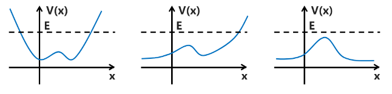
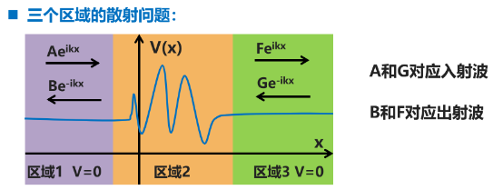

# Chapter 7: 势垒与势阱散射

## 束缚态和散射态

**束缚态：** 势能函数满足 $E<V(-\infty)$ 且 $E<V(\infty)$，无穷远处波函数为 0，能级离散，可归一化。

**散射态：** 势能函数满足 $E>V(-\infty)$ 或 $E>V(\infty)$，无穷远处波函数非 0，能级连续，不可归一化。

## 一维方势垒的散射

哈密顿量：$\hat{H}=-\frac{\hbar^2}{2m}\frac{\partial^2}{\partial x^2}+V(x)$，$V(x)=\begin{cases} V_0,\quad x\in(0,a) \\0,\quad otherwise \end{cases}$

定态薛定谔方程：$\hat{H}\phi_i(x)=E_i\phi_i(x)\Rightarrow\frac{\partial^2}{\partial x^2}\phi_i(x)=\frac{2m}{\hbar^2}\left(V(x)-E_i \right)\phi_i(x)$

**散射：** 散射本质上是动力学问题，由于哈密顿量不含时（薛定谔绘景），可以从本征态出发进行研究。一个粒子从一侧进入势场，可能发生透射和反射。化学反应本质上是散射问题。

$\frac{\partial}{\partial t}\psi(x,t)=\frac{\hat{H}}{i\hbar}\psi(x,t)\quad \psi(x,t)=\sum_ic_i(t)\phi_i(x)$

**对于 $x<0$ 与 $x>a$ 区域：**

$\frac{\partial^2}{\partial x^2}\phi(x)=-\frac{2mE}{\hbar^2}\phi(x)=-k^2\phi(x)$          其中 $k=\sqrt{\frac{2mE}{\hbar^2}}$

有通解：$\begin{cases} \phi(x)|_{x<0}=Ae^{ikx}+Be^{-ikx}\\ \phi(x)|_{x>a}=Fe^{ikx}+Ge^{-ikx} \end{cases}$          其中 $e^{\pm ikx}$ 代表正/负演化的平面波。

若初始入射波为正向，那么 $G=0$，于是：$\phi(x)=\begin{cases} Ae^{ikx}+Be^{-ikx},\quad x<0 \\ Fe^{ikx},\qquad\qquad\quad x>a \end{cases}$

**对于 $0\le x\le a$  区域：**

$\frac{\partial^2}{\partial x^2}\phi(x)=\frac{2m}{\hbar^2}(V_0-E)\phi(x)=\beta^2\phi(x)$          其中 $\beta=\sqrt{\frac{2m}{\hbar^2}(V_0-E)}$

有通解：$\phi(x)=Ce^{\beta x}+De^{-\beta x}$​

> 用 $x=0$ 与 $x=a$​ 处的波函数及其一阶导数连续作为边界条件
>
> $$
> \begin{cases}
> \phi(0)= A+B = C+D \\
> \phi'(0)= ik(A-B)=\beta(C-D)
> \end{cases} \tag{1} \\
> $$
>
> $$
> \begin{cases}
> \phi(a)= Ce^{\beta a}+De^{-\beta a}= Fe^{ika}\\
> \phi'(a)= C\beta e^{\beta a}-D\beta e^{-\beta a}= ikFe^{ika}
> \end{cases}\tag{2}
> $$
>
> 由 (1) (2) 式分别解得：
>
> $$
> \begin{cases}
> A =\frac{1}{2}(1+\beta/ik)C+\frac{1}{2}(1-\beta/ik)D  \\
> B =\frac{1}{2}(1-\beta/ik)C+\frac{1}{2}(1+\beta/ik)D
> \end{cases} \tag{3}
> $$
>
> $$
> \begin{cases}
> C =\frac{F}{2}(1+ik/\beta)e^{ika-\beta a} \\
> D =\frac{F}{2}(1-ik/\beta)e^{ika+\beta a}
> \end{cases} \tag{4}
> $$
>
> 联立 (3) (4) 得：（双曲正弦函数 $\sinh(x)=(e^x-e^{-x})/2$，双曲余弦函数 $\cosh(x)=(e^x+e^{-x})/2$）
>
> $$
> \begin{aligned}
> &\begin{cases}
> A = F\left [ \frac{1}{2}(1+\beta/ik)\frac{1}{2}(1+ik/\beta)e^{ika-\beta a}+\frac{1}{2}(1-\beta/ik)\frac{1}{2}(1-ik/\beta)e^{ika+\beta a} \right]  \\
> B = F\left [ \frac{1}{2}(1-\beta/ik)\frac{1}{2}(1+ik/\beta)e^{ika-\beta a}+\frac{1}{2}(1+\beta/ik)\frac{1}{2}(1-ik/\beta)e^{ika+\beta a} \right] \\
> \end{cases} \\
> &\Rightarrow \begin{cases}
> \frac{F}{A}=\frac{-2ik/\beta}{(1-k^2/\beta^2)\sinh(\beta a)-(2ik/\beta)\cosh(\beta a)}e^{-ika} \\
> \frac{B}{A}=\frac{-(1+k^2/\beta^2)\sinh(\beta a)}{(1-k^2/\beta^2)\sinh(\beta a)-(2ik/\beta)\cosh(\beta a)}
> \end{cases}
> \end{aligned}
> $$
>
> 定义透射概率：$T=\frac{|F|^2}{|A|^2}=\frac{4k^2\beta^2}{(k^2+\beta^2)^2\sinh^2(\beta a)+4k^2\beta^2}$；反射概率：$R=\frac{|B|^2}{|A|^2}=\frac{(k^2+\beta^2)^2\sinh^2(\beta a)}{(k^2+\beta^2)^2\sinh^2(\beta a)+4k^2\beta^2}$。
>
> 显然有：$R+T=\frac{|F|^2+|B|^2}{|A|^2}=1$。

**量子隧穿效应：** 在经典力学中，若体系能量小于势垒高度，那么透射率为 0；但在量子力学中，透射率非 0，这一现象称为量子隧穿。

$T=\frac{4k^2\beta^2}{(k^2+\beta^2)^2\sinh^2(\beta a)+4k^2\beta^2}=\frac{1}{\frac{V_0^2}{4E(V_0-E)}\sinh^2(\sqrt{2m(V_0-E)/\hbar^2}a)+1}$

当 $E=0$ 时，$k=0$，$T=0$；当 $E=V_0$ 时，$\frac{V_0^2}{4E(V_0-E)}=\frac{mV_0^2/\hbar^2\times a^2}{2E\times2m(V_0-E)/\hbar^2\times a^2}=\frac{mV_0^2a^2/(2E\hbar^2)}{2m(V_0-E)a^2/\hbar^2}$。

$$
\lim_{x\rightarrow 0}\frac{\sinh^2(x)}{x^2}=\lim_{x\rightarrow0}\frac{\left[ (e^x-e^{-x})/2 \right]^2}{x^2}=\lim_{x\rightarrow0}\frac{\{\left[ (1+x+o(x^2))-(1-x+o(x^2)) \right]/2\}^2}{x^2}=\lim_{x\rightarrow0}\frac{x^2}{x^2}= 1
$$

$$
\therefore \lim_{V_0\rightarrow E}T =\lim_{V_0-E\rightarrow0}\frac{1}{\frac{\sinh^2(\sqrt{2m(V_0-E)/\hbar^2}a)}{2m(V_0-E)a^2/\hbar^2}\frac{mV_0^2a^2}{2E\hbar^2}+1}=\frac{1}{\frac{mV_0^2a^2}{2E\hbar^2}+1}< 1
$$

【我们可以得到：势垒越窄，质量越小，势垒越低，越容易发生量子隧穿。】

对于 $0\le x\le a$  区域，当 $E>V_0$ 时，通解变为：$\phi(x)=Ce^{i\beta'x}+De^{-i\beta'x},\beta'=\sqrt{2m(E-V_0)/\hbar^2}$，即将 $\beta$ 换成 $i\beta'$​.

代入上式得：$T=\frac{-4k^2\beta'^2}{(k^2-\beta'^2)^2\sinh^2(i\beta'a)-4k^2\beta'^2}$

由于 $\sinh(ix)=(e^{ix}-e^{-ix})/2=i\sin(x)$，则：$T=\frac{4k^2\beta'^2}{(k^2-\beta'^2)^2\sin^2(\beta'a)+4k^2\beta'^2}<1$

在经典力学中，若体系能量大于势垒高度，那么透射率为 1；但在量子体系中，透射率非 1，也是一种典型的量子现象。

## 一维方势阱的散射

哈密顿量：$\hat{H}=-\frac{\hbar^2}{2m}\frac{\partial^2}{\partial x^2}+V(x)$，$V(x)=\begin{cases} -V_0,\quad x\in(0,a) \\0,\quad otherwise \end{cases}$

定态薛定谔方程及其通解：

$$
\begin{aligned}
\hat{H}\phi(x)= E\phi(x)
&\Rightarrow \phi(x)=
\begin{cases}
Ae^{ikx}+Be^{-ikx},\quad x\in(-\infty,0) \\
Ce^{i\beta x}+De^{-i\beta x},\quad x\in(0, a) \\
Fe^{ikx},\quad x\in(a,+\infty)
\end{cases}\\
&其中\quad k =\sqrt{2mE/\hbar}\quad\beta =\sqrt{2m(E+V_0)/\hbar}
\end{aligned}
$$

对于其透射概率，在一维方势阱 $E>V_0$ 的公式基础上，仅需将 $V_0$ 改成 $-V_0$ 即可。

$$
T =\frac{4k^2\beta^2}{(k^2-\beta^2)^2\sin^2(\beta a)+4k^2\beta^2}=\frac{1}{\frac{V_0^2}{4E(E+V_0)}\sin^2\left( \frac{a}{\hbar}\sqrt{2m(E+V_0)} \right)+1}
$$

**共振透射：** 在经典力学中，若体系能量大于 0，透射率必为 1；但在量子力学中，仅在一些条件下为 1，此时透射称为共振透射。即使是势阱也可以发生反射，这也是量子效应的体现。

条件：$\frac{a}{\hbar}\sqrt{2m(E+V_0)}=n\pi\quad\Rightarrow E=-V_0+\frac{n^2\pi^2\hbar^2}{2ma^2}\quad m=1,2,3,\dots$

机制：一维方势阱可以被认为由三部分组成，左侧和右侧都是半无穷大的真空，其本征态为平面波，可以取任意正的能量，而中间是无限深方势阱，具有离散能级。当平面波的能量等于势阱的离散能级时，电子态彻底离域化，发生共振透射。

> 
>
> 波函数的通式为 $\phi(x)=\begin{cases} Ae^{ikx}+Be^{-ikx},\quad region1 \\ Cf(x)+Dg(x),\quad region2 \\ Fe^{ikx}+Ge^{-ikx},\quad region3 \end{cases}$
>
> 同前文方法，从波函数及其一阶导数的连续性可以得到 4 个边界条件。
>
> $$
> \begin{cases}
> Ae^{ikx_1} +Be^{-ikx_1}= Cf(x_1)+Dg(x_1) \\
> ikAe^{ikx_1} -ikBe^{-ikx_1}= Cf'(x_1)+Dg'(x_1)
> \end{cases} \tag{1}
> $$
>
> $$
> \begin{cases}
> Fe^{ikx_2} +Ge^{-ikx_2}= Cf(x_2)+Dg(x_2) \\
> ikFe^{ikx_2} -ikGe^{-ikx_2}= Cf'(x_2)+Dg'(x_2)
> \end{cases} \tag{2}
> $$
>
> 我们可以消去 $C$ 与 $D$ 解得：
>
> $$
> \begin{pmatrix}
> B\\
> F\\
> \end{pmatrix}=
> \begin{pmatrix}
> S_{11}&S_{12} \\
> S_{21}&S_{22} \\
> \end{pmatrix}
> \begin{pmatrix}
> A\\
> G\\
> \end{pmatrix},\quad 矩阵 S 被称为散射矩阵 .
> $$
>
> 若 $G=0$，即入射波往右：$R_l=\left( |B|^2/|A|^2 \right)|_{G=0}=|S_{11}|^2,\quad T_l=\left( |F|^2/|A|^2 \right)|_{G=0}=|S_{21}|^2$
>
> 若 $A=0$，即入射波往右：$R_r=\left( |F|^2/|G|^2 \right)|_{A=0}=|S_{22}|^2,\quad T_r=\left( |B|^2/|G|^2 \right)|_{A=0}=|S_{12}|^2$

## WKB 近似

WKB 是 Wenzel、Kramers 和 Brillouin 的缩写，是一种求解势函数不是常数时定态薛定谔方程的近似方法。其核心思想是：如果势函数变化非常缓慢，除了波长和振幅随着坐标缓慢变化外，可以合理地假设波函数仍然保持平面波的形式。

**基本步骤：**

将波函数表达为指数函数，其中指数为约化普朗克常数的幂级数展开。将指数函数代入定态薛定谔方程，认为约化普朗克常数同次幂的项相等，得到相应的方程。求解这些方程，可以得到本征态的波函数。

因为约化普朗克常数是个小量，可以截断到有限阶，得到波函数的近似解，所以本质上 WKB 是一种微扰方法。由于约化普朗克常数严格为 0 时，量子力学退化到经典力学。考虑有限阶的约化普朗克常数，使得 WKB 近似成为一种半经典动力学方法。

> 定态薛定谔方程：$-\frac{\hbar^2}{2m}\frac{d^2}{dx^2}\phi(x)+V(x)\phi(x)=E\phi(x)\Rightarrow \hbar^2\frac{d^2}{dx^2}\phi(x)=2m(V(x)-E)\phi(x)$
>
> 波函数的指数形式：$\phi(x)=e^{\varphi(x)/\hbar}$，代入得：
>
> $$
> \begin{aligned}
> 等式左侧 &= \hbar^2\frac{d^2}{dx^2}\phi(x)=\hbar^2\frac{d^2}{dx^2}e^{\varphi(x)/\hbar}=\hbar^2\frac{d}{dx}\left( \frac{\varphi'(x)}{\hbar}e^{\varphi(x)/\hbar} \right)=\hbar\frac{d}{dx}\left( \varphi'(x)e^{\varphi(x)/\hbar} \right) \\
> &= \hbar\left( \varphi''(x)e^{\varphi(x)/\hbar}+\frac{\varphi'(x)^2}{\hbar}e^{\varphi(x)/\hbar} \right)=\left( \hbar\varphi''(x)+\varphi'(x)^2 \right)e^{\varphi(x)/\hbar} \\
> 等式右边 &= 2m\left( V(x)-E \right)\phi(x)= 2m\left( V(x)-E \right)e^{\varphi(x)/\hbar}
> \end{aligned}
> $$
>
> 因此，定态薛定谔方程变为 $\hbar\varphi''(x)+\varphi'(x)^2=2m(V(x)-E)$。

对指数项进行实部和虚部分离，有：

$$
\begin{aligned}
& \begin{cases}
\varphi'(x)= A(x)+iB(x) \\
\hbar\varphi''(x)+\varphi'(x)^2 = 2m(V(x)-E)
\end{cases} \\
& \Rightarrow \hbar [A'(x)+iB'(x)]+[A(x)+iB(x)]^2 = 2m(V(x)-E) \\
& \Rightarrow \begin{cases}
\hbar A'(x)+A^2(x)-B^2(x)= 2m(V(x)-E) \\
\hbar B'(x)+2A(x)B(x)= 0
\end{cases}
\end{aligned}
$$

> 按约化普朗克常数展开，取 $A(x)=\sum_{n=0}A_n(x)\hbar^n$ 和 $B(x)=\sum_{n=0}B_n(x)\hbar^n$，有：
>
> $$
> \begin{cases}
> \hbar [\sum_{n = 0}A'_n(x)\hbar^n]+[\sum_{n = 0}A_n(x)\hbar^n]^2-[\sum_{n = 0}B_n(x)\hbar^n]^2 = 2m(V(x)-E) \\
> \hbar [\sum_{n = 0}B'_n(x)\hbar^n]+2[\sum_{n = 0}A_n(x)\hbar^n][\sum_{n=0}B_n(x)\hbar^n] = 0
> \end{cases}
> $$
>
> 取 $n=0$，得零阶方程：$\begin{cases} A_0^2(x)-B_0^2(x)=2m(V(x)-E) \\ 2A_0(x)B_0(x)=0 \end{cases}$
>
> 假设振幅变化远慢于相位变化，有 $A_0(x)\ll B_0(x)$，即：$\begin{cases} A_0(x)\approx0 \\ B_0(x)\approx\pm\sqrt{2m(E-V(x))}\quad[要求E\ge V(x)] \end{cases}$
>
> 取 $n=1$，得一阶方程：$\begin{cases} A_0'(x)+2A_0(x)A_1(x)-2B_0(x)B_1(x)=0 \\ B_0'(x)+2A_0(x)B_1(x)+2A_1(x)B_0(x)=0 \end{cases}$
>
> 代入零阶方程的解，得：$\begin{cases} -2B_0(x)B_1(x)=0 \\ B_0'(x)+2A_1(x)B_0(x)=0 \end{cases} \Rightarrow \begin{cases} B_1(x)=0 \\ A_1(x)=-\frac{B_0'(x)}{2B_0(x)}=\frac{d}{dx}\ln B_0^{-1/2} \end{cases}$​

> 一阶近似下的近似波函数：
>
> $$
> \begin{aligned}
> \phi(x)&= e^{\varphi(x)/\hbar}=\exp\left [ \int_{x_0}^x \varphi'(x')dx'/\hbar \right] =\exp\left [ \int_{x_0}^x A(x)dx'/\hbar \right]\exp\left [ \int_{x_0}^x B(x)dx'/\hbar \right] \\
> & \approx \exp\left [ \int_{x_0}^x A_1(x')dx' \right]\exp\left [ i\int_{x_0}^x B_0(x')dx'/\hbar \right] \\
> &= B_0^{-1/2}\exp\left [ \pm i \int_{x_0}^x p(x')dx'/\hbar \right]\approx \frac{C_{\pm}}{\sqrt{p(x)}}\exp\left [ \pm i \int_{x_0}^x p(x')dx'/\hbar \right]
> \end{aligned}
> $$
>
> 如果相位变化远慢于振幅变化：
>
> $$
> \begin{aligned}
> &B_0(x)\ll A_0(x) \Rightarrow \begin{cases}
> A_0(x)=\pm\sqrt{2m(V(x)-E)}\equiv \pm p(x)\quad [经典运动不允许这一情形] \\
> B_0(x)= 0 \\
> \end{cases} \\
> &\phi(x) \approx \frac{C_{\pm}}{\sqrt{p(x)}}\exp\left [ \pm \int_{x_0}^x p(x')dx'/\hbar \right]
> \end{aligned}
> $$
