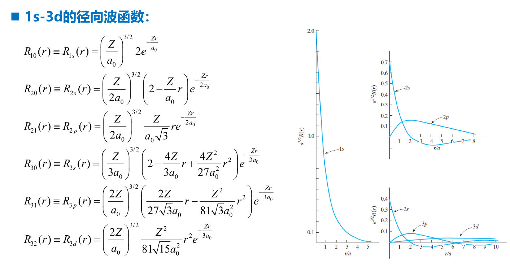
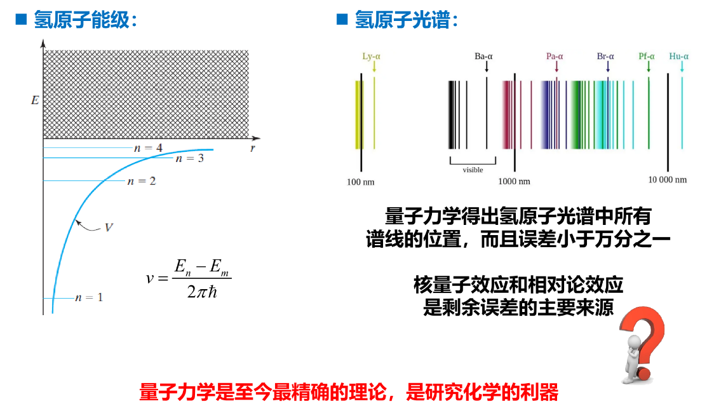

# Chapter 8: 单电子原子和离子

## 玻恩-奥本海默近似

对于一个原子，其不含时的薛定谔方程为：

$$
\left( \frac{-\hbar^2\nabla^2}{2M}+\sum_i\frac{-\hbar^2\nabla_i^2}{2m_e}+\sum_{i < j}\frac{e^2}{4\pi\varepsilon_0|\vec{r}_i-\vec{r}_j|}+\sum_i\frac{-Ze^2}{4\pi\varepsilon_0|\vec{r}_i-\vec{R} | } \right)\psi(\vec{R},\{\vec{r}_i \})= E\psi(\vec{R},\{\vec{r}_i \})
$$

其中，哈密顿量第一项为原子核动能，第二项为电子动能，第三项为电子-电子库仑作用，第四项为电子-核库仑作用；$\psi(\vec{R},\{\vec{r}_i \})$ 为核和多电子波函数，$E$ 为本征态能量。

**玻恩-奥本海默近似：** 原子核的量子效应远弱于电子，通常可以忽略，则得到：

$$
\left( \sum_i\frac{-\hbar^2\nabla_i^2}{2m_e}+\sum_{i < j}\frac{e^2}{4\pi\varepsilon_0|\vec{r}_i-\vec{r}_j|}+\sum_i\frac{-Ze^2}{4\pi\varepsilon_0|\vec{r}_i-\vec{R} | } \right)\psi(\{\vec{r}_i \})= E\psi(\{\vec{r}_i \})
$$

## 两体问题

两粒子体系的不含时薛定谔方程为：

$$
\hat{H}=-\frac{\hbar^2}{2m_1}\nabla^2_1-\frac{\hbar^2}{2m_2}\nabla^2_2+V\qquad \hat{H}\psi(\vec{r}_1,\vec{r}_2)= E\psi(\vec{r}_1,\vec{r}_2)
$$

质心坐标和相对坐标：

$$
\vec{R}=\frac{m_1\vec{r}_1+m_2\vec{r}_2}{m_1+m_2} \qquad \vec{r}=\vec{r}_1-\vec{r}_2 \qquad \psi(\vec{r}_1,\vec{r}_2)=\psi(\vec{R},\vec{r})
$$

相对坐标下的哈密顿量：

$$
\begin{aligned}
\frac{\partial}{\partial x_1} &= \frac{\partial}{\partial X}\frac{\partial X}{\partial x_1} + \frac{\partial}{\partial x}\frac{\partial x}{\partial x_1}=\frac{m_1}{m_1+m_2}\frac{\partial}{\partial X}+\frac{\partial}{\partial x}\Rightarrow\nabla_1 =\frac{m_1}{m_1+m_2}\nabla_R+\nabla_r\\
\Rightarrow \hat{H} &= -\frac{\hbar^2}{2m_1}\left( \frac{m_1}{m_1+m_2}\nabla_R+\nabla_r \right)^2 -\frac{\hbar^2}{2m_2}\left( \frac{m_2}{m_1+m_2}\nabla_R-\nabla_r \right)^2 +V(r) \\
&= -\frac{\hbar^2}{2(m_1+m_2)}\nabla^2_R-\frac{\hbar^2}{2\mu}\nabla_r^2+V(r)  \quad \qquad \mu\equiv \frac{m_1m_2}{m_1+m_2}
\end{aligned}
$$

我们可以得到，哈密顿量分为关于 $R$ 与 $r$ 的两部分且彼此独立。

> 为了求解方便，我们希望将两体问题简化为单体问题。
>
> 变量分离法：
>
> $$
> \begin{aligned}
> &\begin{cases}
> \left [ -\frac{\hbar^2}{2(m_1+m_2)}\nabla^2_R-\frac{\hbar^2}{2\mu}\nabla_r^2+V(r) \right]\psi(\vec{R},\vec{r})= E_T\psi(\vec{R},\vec{r}) \\
> \psi =\phi(\vec{r})\varphi(\vec{R})
> \end{cases} \\
> &\Rightarrow\left [ -\frac{\hbar^2}{2(m_1+m_2)}\frac{1}{\varphi}\nabla^2_R\varphi \right]+\left [ -\frac{\hbar^2}{2\mu}\frac{1}{\phi} \nabla_r^2\phi+V(r) \right] = E_T \\
> &\Rightarrow \begin{cases}
> -\frac{\hbar^2}{2(m_1+m_2)}\nabla^2_R\varphi(\vec{R})=(E_T-E)\varphi(\vec{R}) \\
> \left(-\frac{\hbar^2}{2\mu} \nabla_r^2+V(r)\right)\phi(\vec{r})= E\phi(\vec{r})
> \end{cases}
> \end{aligned}
> $$

>最后一个方程组中，第一个式子为自由粒子的薛定谔方程，第二个式子为两体相对运动的薛定谔方程。
>
>与玻恩-奥本海默近似相比，这里只是改变了单体的质量。

## 氢原子与类氢离子

氢原子与类氢离子（$\ce{ H, He^+, Li^{2+},\dots }$）是唯一能够解析精准求解的一类原子，只包含一个电子和一个原子核，在玻恩-奥本海默近似或只考虑两体相对运动时是单体问题。

$$
\left( \frac{\hbar^2}{2\mu}\nabla^2-\frac{Ze^2}{4\pi\varepsilon_0r} \right)\psi = E\psi
$$

同时，氢原子和类氢离子中的电子-核相互作用势能关于原子核中心对称，在球坐标系中更易处理。

> **【以下为笔者推导过程，即第6讲《箱中粒子与能级》作业】**
>
> 球坐标系下 $x=r\sin\theta\cos\phi,y=r\sin\theta\sin\phi,z=r\cos\theta$​.
>
> 通过解方程组：
>
> $$
> \begin{pmatrix}
> \frac{\partial}{\partial r}\\
> \frac{\partial}{\partial \theta}\\
> \frac{\partial}{\partial \phi}
> \end{pmatrix}
> =
> \begin{pmatrix}
> \frac{\partial x}{\partial r} & \frac{\partial y}{\partial r} & \frac{\partial z}{\partial r} \\
> \frac{\partial x}{\partial \theta} & \frac{\partial y}{\partial \theta} & \frac{\partial z}{\partial \theta} \\
> \frac{\partial x}{\partial \phi} & \frac{\partial y}{\partial \phi} & \frac{\partial z}{\partial \phi}
> \end{pmatrix}
> \begin{pmatrix}
> \frac{\partial}{\partial x}\\
> \frac{\partial}{\partial y}\\
> \frac{\partial}{\partial z}
> \end{pmatrix}
> \triangleq
> A\begin{pmatrix}
> \frac{\partial}{\partial x}\\
> \frac{\partial}{\partial y}\\
> \frac{\partial}{\partial z}
> \end{pmatrix}
> $$
>
> 得到：
>
> $$
> \begin{pmatrix}
> \frac{\partial}{\partial x}\\
> \frac{\partial}{\partial y}\\
> \frac{\partial}{\partial z}
> \end{pmatrix}
> = A^{-1}
> \begin{pmatrix}
> \frac{\partial}{\partial r}\\
> \frac{\partial}{\partial \theta}\\
> \frac{\partial}{\partial \phi}
> \end{pmatrix},\qquad
> \begin{pmatrix}
> \frac{\partial^2}{\partial x^2}\\
> \frac{\partial^2}{\partial y^2}\\
> \frac{\partial^2}{\partial z^2}
> \end{pmatrix}
> = \left( A^{-1} \right)^{2}
> \begin{pmatrix}
> \frac{\partial^2}{\partial r^2}\\
> \frac{\partial^2}{\partial \theta^2}\\
> \frac{\partial^2}{\partial \phi^2}
> \end{pmatrix}
> $$
>
> 从而：
>
> $$
> \nabla^2 = \frac{\partial^2}{\partial x^2}+\frac{\partial^2}{\partial y^2}+\frac{\partial^2}{\partial z^2} =\frac{1}{r^2}\frac{\partial}{\partial r}\left( r^2 \frac{\partial}{\partial r} \right) + \frac{1}{r^2\sin\theta}\frac{\partial}{\partial\theta}\left( \sin\theta\frac{\partial}{\partial\theta} \right) + \frac{1}{r^2\sin^2\theta}\frac{\partial^2}{\partial \phi^2}
> $$

从而我们得到在球坐标系下的总动量算符和动能算符：

$$
\hat{\vec{p}}=-i\hbar \left( \vec{e}_r\frac{\partial}{\partial r}+\vec{e}_{\theta}\frac{1}{r}\frac{\partial}{\partial \theta}+\vec{e}_{\phi}\frac{1}{r\sin\theta}\frac{\partial}{\partial \phi} \right)\\$$

$$\hat{T}=\frac{\hat{\vec{p}}^2}{2\mu}=-\frac{\hbar^2}{2\mu}\left( \vec{e}_r\frac{\partial}{\partial r}+\vec{e}_{\theta}\frac{1}{r}\frac{\partial}{\partial \theta}+\vec{e}_{\phi}\frac{1}{r\sin\theta}\frac{\partial}{\partial \phi} \right)\left( \vec{e}_r\frac{\partial}{\partial r}+\vec{e}_{\theta}\frac{1}{r}\frac{\partial}{\partial \theta}+\vec{e}_{\phi}\frac{1}{r\sin\theta}\frac{\partial}{\partial \phi} \right)
$$

**同时，需要注意的是，动量算符的分量不能简单取径向与角向单位向量的系数。**

> $$
> \hat{p}_r \equiv \vec{e}_r \cdot \hat{\vec{p}} \rightarrow \frac{1}{2}\left( \vec{e}_r \cdot \hat{\vec{p}} + \hat{\vec{p}} \cdot \vec{e}_r \right)=-i\hbar\left( \frac{\partial}{\partial r}+\frac{1}{r} \right) \\$$
>
> $$\hat{p}_\theta \equiv \vec{e}_\theta \cdot \hat{\vec{p}} \rightarrow \frac{1}{2}\left( \vec{e}_\theta \cdot \hat{\vec{p}} + \hat{\vec{p}} \cdot \vec{e}_\theta \right)=-i\hbar\frac{1}{r}\left( \frac{\partial}{\partial \theta}+\frac{1}{2\tan\theta} \right) \\$$
>
> $$\hat{p}_\phi \equiv \vec{e}_\phi \cdot \hat{\vec{p}} \rightarrow \frac{1}{2}\left( \vec{e}_\phi \cdot \hat{\vec{p}} + \hat{\vec{p}} \cdot \vec{e}_\phi \right)=-i\hbar\frac{1}{r\sin\theta}\frac{\partial}{\partial\phi}
> $$

球坐标系下的动能项：

$$
\hat{T}\psi =-\frac{\hbar^2}{2\mu}\nabla^2\psi =-\frac{\hbar^2}{2\mu}\frac{1}{r^2}\left[ \frac{\partial}{\partial r}\left( r^2 \frac{\partial\psi}{\partial r} \right) + \frac{1}{\sin\theta}\frac{\partial}{\partial\theta}\left( \sin\theta\frac{\partial\psi}{\partial\theta} \right) + \frac{1}{\sin^2\theta}\frac{\partial^2\psi}{\partial \phi^2} \right]
$$

类氢离子的薛定谔方程：

$$
\begin{aligned}
& \hat{H}\psi = E\psi \Rightarrow \left( -\frac{\hbar^2}{2\mu}\nabla^2-\frac{Ze^2}{4\pi\varepsilon_0r} \right)\psi = E\psi \\
& \Rightarrow -\frac{\hbar^2}{2\mu r^2}\left[ \frac{\partial}{\partial r}\left( r^2 \frac{\partial\psi}{\partial r} \right) + \frac{1}{\sin\theta}\frac{\partial}{\partial\theta}\left( \sin\theta\frac{\partial\psi}{\partial\theta} \right) + \frac{1}{\sin^2\theta}\frac{\partial^2\psi}{\partial \phi^2} \right] -\frac{Ze^2}{4\pi\varepsilon_0r}\psi = E\psi \\
& \Rightarrow \begin{cases}
-\frac{\hbar^2}{2\mu r^2} \frac{\partial}{\partial r}\left( r^2 \frac{\partial\psi}{\partial r} \right)  -\frac{Ze^2}{4\pi\varepsilon_0r}\psi =(E-\frac{\hbar^2\beta}{2\mu r^2})\psi \\
-\frac{1}{\sin\theta}\frac{\partial}{\partial\theta}\left( \sin\theta\frac{\partial\psi}{\partial\theta} \right) - \frac{1}{\sin^2\theta}\frac{\partial^2\psi}{\partial \phi^2}=\beta\psi
\end{cases},\ {}\beta 为常数.
\end{aligned}
$$

代入分离变量的波函数 $\psi(r,\theta,\phi)=R(r)Y(\theta,\phi)$，得：

$$
\begin{cases}
-\frac{\hbar^2}{2\mu r^2} \frac{d}{d r}\left( r^2 \frac{d R}{d r} \right)  -\frac{Ze^2}{4\pi\varepsilon_0r}R =(E-\frac{\hbar^2\beta}{2\mu r^2})R \\
-\frac{1}{\sin\theta}\frac{\partial}{\partial\theta}\left( \sin\theta\frac{\partial Y}{\partial\theta} \right) - \frac{1}{\sin^2\theta}\frac{\partial^2 Y}{\partial \phi^2}=\beta Y
\end{cases}
$$

再代入角向波函数分离变量 $Y(\theta,\phi)=\Theta(\theta)\Phi(\phi)$，两边同乘以 $\frac{\sin^2(\theta)}{\Theta\Phi}$ 得：

$$
\begin{cases}
\frac{1}{\Phi}\frac{d^2\Phi}{dx^2}=-\alpha\\
\beta\sin^2\theta+\frac{\sin\theta}{\Theta}\frac{d}{d\theta}\left( \sin\theta\frac{d\Theta}{d\theta} \right)=\alpha
\end{cases}
$$

同样我们能够得到球谐函数，同三维无限深球形势箱，见 **§2 D. (4)**

> 轨道角动量算符：
>
> $$
> \begin{aligned}
> & L = r\times p \\
> & \Rightarrow \begin{cases}
> L_x =-i\hbar\left( -\sin\phi\frac{\partial}{\partial\theta}-\cos\phi\cot\theta\frac{\partial}{\partial\phi} \right) \\
> L_y =-i\hbar\left( \cos\phi\frac{\partial}{\partial\theta}-\sin\phi\cot\theta\frac{\partial}{\partial\phi} \right) \\
> L_z =-i\hbar\frac{\partial}{\partial\phi}
> \end{cases} \\
> & \Rightarrow L^2 = -\hbar^2\left [ \frac{1}{\sin\theta}\frac{\partial}{\partial\theta}\left( \sin\theta\frac{\partial}{\partial\theta} \right) + \frac{1}{\sin^2\theta}\frac{\partial^2}{\partial \phi^2} \right]
> \end{aligned}
> $$
>
> 取角量子数 $l$ 和磁量子数 $m$，$L^2Y_{lm}=l(l+1)\hbar^2Y_{lm}\quad L_zY_{lm}=m\hbar Y_{lm}$，即 $\beta=l(l+1)$
>
> 角向波函数是角动量算符的本征态，由两个参数 $l$ 和 $m$ 刻画；轨道角动量在空间上的分布是分立的，具有量子的基本特征。

径向薛定谔方程：

$$
\begin{aligned}
&-\frac{\hbar^2}{2\mu r^2} \frac{d}{d r}\left( r^2 \frac{d R}{d r} \right)  -\frac{Ze^2}{4\pi\varepsilon_0r}R =(E-\frac{l(l+1)\hbar^2}{2\mu r^2})R \\
&\Rightarrow \left[ -\frac{\hbar^2}{2\mu}\left( \frac{d^2}{dr^2}+\frac{2}{r}\frac{d}{dr} \right)-\frac{Ze^2}{4\pi\varepsilon_0r}+\frac{l(l+1)\hbar^2}{2\mu r^2} \right] R = ER\\
&\Rightarrow R''+\frac{2}{r}R'+\left( \frac{2\mu E}{\hbar^2}+\frac{2\mu Ze^2}{4\pi\varepsilon_0r\hbar^2}-\frac{l(l+1)}{r^2} \right)R = 0\\
&\Rightarrow R''+\frac{2}{r}R'+\left( \frac{8\pi\varepsilon_0E}{a_0e^2}+\frac{2Z}{a_0r}-\frac{l(l+1)}{r^2} \right)R = 0\quad(where\ {} a_0\equiv\frac{4\pi\varepsilon_0\hbar^2}{\mu e^2}, 即玻尔半径)
\end{aligned}
$$

由此得到径向波函数：$R_{nl}(r)=\sqrt{\left( \frac{2Z}{n} \right)^3\frac{(n-l-1)!}{2n[(n+l)!]}}e^{-Zr/na_0}\left( \frac{2Zr}{na_0} \right)^l L_{n-l-1}^{2l+1}\left( \frac{2Zr}{na_0} \right)$，

其中我们引入伴随拉盖尔多项式 $L_n^{\alpha}(x)=x^{-\alpha}\frac{1}{n!}\left( \frac{d}{dx}-1 \right)^nx^{n+\alpha}$。

进而得到本征态能量：$E_n=-\frac{Z^2}{n^2}\frac{e^2}{8\pi\varepsilon_0a_0}=\frac{Z^2\mu e^4}{8\varepsilon_0^2n^2\hbar^2}\quad n=1,2,\dots\quad l=0,1,\dots,n-1$，$n$​ 称为主量子数。

**典型的径向波函数：**

{width=75%}

## 原子轨道

**原子轨道：** 氢原子和类氢离子的本征态称为原子轨道，由三个参数 $n,l,m$ 描述，本征值由 $n$ 决定，最低的本征态称为基态，其他本征态称为激发态。

$$
\psi_{nlm}(r,\theta,\phi)= R_{nl}(r)Y_{lm}(\theta,\phi)\quad E_n =-\frac{Z^2\mu e^4}{8\varepsilon_0^2n^2\hbar^2}\\
n = 1,2,3,\dots \quad l = 0,1,2,\dots, n-1 \quad m = 0,\pm1,\pm2,\dots,\pm l
$$

其中能级 $E_n$ 的简并度为：$f_n=\sum_{l=0}^{n-1}(2l+1)=n^2$​。

> 当 $\vec{r}\rightarrow-\vec{r}$，即：$r\rightarrow r,\theta\rightarrow \pi-\theta,\phi\rightarrow \pi+\phi$，原子轨道 $R_{nl}(r)Y_{lm}(\theta,\phi) \rightarrow R_{nl}(r)Y_{lm}(\pi-\theta,\pi+\phi)$。
>
> 其中，$Y_{lm}(\theta,\phi) \sim P_l^{|m|}(\cos\theta e^{im\phi})$，
>
> $\therefore Y_{lm}(\theta,\phi) \rightarrow Y_{lm}(\pi-\theta,\pi+\phi)=(-1)^m(-1)^{l+m}Y_{lm}(\theta,\phi)=(-1)^l Y_{lm}(\theta,\phi)$​。
>
> 因此，$\psi_{nlm}(\vec{r}) \rightarrow \psi_{nlm}(-\vec{r})=(-1)^l\psi_{nlm}(\vec{r}) \leftarrow l$ 决定宇称
>
> 若波函数变号，则称为奇宇称；若符号不变，则称为偶宇称。

**氢原子光谱：**

{width=75%}
