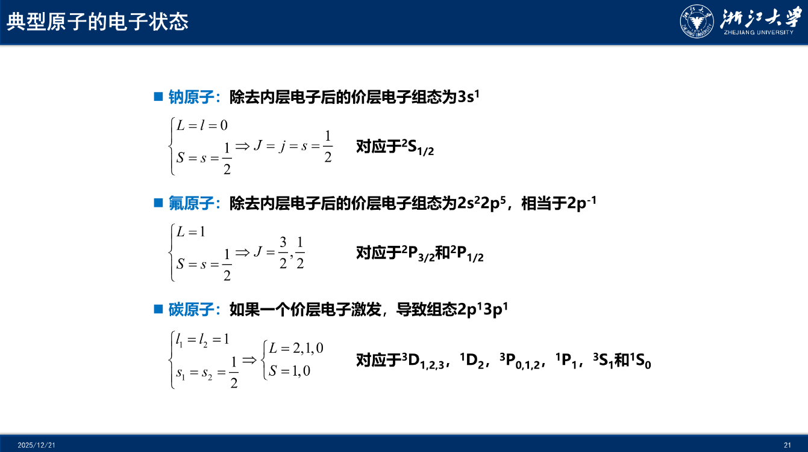

# Chapter 9: 多电子原子和自旋

## 轨道近似与电荷屏蔽

**多电子原子的不含时薛定谔方程：**

电子之间的库仑相互作用导致多电子原子的不含时薛定谔方程难以解析求解。即使对氦原子，也没有解析的电子本征态和能量。

若我们可以假设每个电子占据自己的轨道，类似于类氢原子的原子轨道，总波函数可以近似地写为 $\psi(\{\vec{r}_i\})=\prod_i\phi_i(\vec{r}_i)$

轨道近似只有在电子间没有相互作用时才是严格的，假设两电子体系的哈密顿量可以分解为两个电子的哈密顿量之和：$\hat{H}=\hat{H}_1+\hat{H}_2$

$$
\begin{cases}
\hat{H}_1\phi_1(\vec{r}_1)= E_1\phi_1(\vec{r}_1) \\
\hat{H}_2\phi_2(\vec{r}_2)= E_2\phi_2(\vec{r}_2) \\
\end{cases} \Rightarrow
\hat{H}\psi =(\hat{H}_1+\hat{H}_2)\psi = E_1\phi_1\phi_2+\phi_1E_2\phi_2 =(E_1+E_2)\psi
$$

**电荷屏蔽：**

在轨道近似下，多电子原子的电子排布取决于原子轨道的能量。内层电子一般较外层电子更稳定，而外层电子的轨道能量可以近似地进行处理。

在类氢离子中，2s 和 2p 是简并的，但在多电子原子中，这种简并性不复存在。电子之间存在库仑相互作用，对一个距离原子核为 $r$ 的电子，它感受到的总电荷是原子核加上 $r$ 范围内其他电子的总电荷，相当于核电荷从 $Ze$ 变为 $Z_{eff}e$，称为有效电荷，$Z-Z_{eff}$​ 称为屏蔽系数。

**轨道穿透：**

不同原子轨道的屏蔽系数不同。比如：s 和 p 轨道具有不同的径向分布，s 电子穿透到内层的程度要大于 p 电子，因此同层 s 电子被屏蔽的程度小于 p 电子，被原子核束缚地更强。类似地，同层原子轨道能量关系为 $s<p<d<f$。

## 电子自旋和不相容原理

1922 年，斯特恩和盖拉赫发现氢原子束经过非均匀磁场会发生偏转，在感光板上呈现两条分立的线。这一现象表明氢原子存在 **磁矩**，而两条分立的线表明氢原子磁矩只有两种数值。

假设氢原子的磁矩为 $\vec{\mu}$，外磁场为 $\vec{B}$，那么氢原子在磁场中具有势能。

$$
U =-\vec{\mu}\cdot\vec{B}=-\mu B_z \cos \theta \Rightarrow F_z =-\frac{\partial U}{\partial z}=\mu \frac{\partial B_z}{\partial z}\cos \theta
$$

电子的 **轨道磁矩** 为 $\vec{\mu}_L=-e\vec{L}/(2m_e)$，由于氢原子基态的轨道角动量为 0，没有轨道磁矩，所以氢原子的磁矩来自电子本身，称为 **自旋磁矩**。

**电子的自旋：**

自旋假设：1. 每个电子都具有自旋角动量 $\vec{S}$，空间投影只能取两个值 $S_z=\pm\frac{\hbar}{2}$；2. 每个电子都具有自旋磁矩 $\vec{\mu}_S$，正比于自旋角动量 $\vec{\mu}_S=-\frac{e}{m_e}\vec{S}$。

单个电子的自旋磁矩称为 **玻尔磁子**，$\mu_B=\frac{e\hbar}{2m_e}$，是电子磁矩的自然单位。

回转磁比率 $\gamma=\frac{\vec{\mu}}{\vec{L}}$，电子自旋的回转磁比率为 $-e/m_e$，是轨道回转磁比率的两倍。

**泡利不相容原理：**

1925 年，泡利提出多于两个电子不能同时占据同一个轨道。如果两个电子占据一个轨道，它们的自旋成对，分别用 $\uparrow \downarrow$ 表示，两电子的总自旋角动量为 0。

微观粒子的 **自旋可以是半整数或整数，分别称为费米子和玻色子**。电子的自旋为 $1/2$，属于费米子，所有的 **费米子都有类似的不相容原理**。

**原子的电子排布：**

轨道近似使得我们能够用原子轨道上的占据情况表达原子的核外电子排布。显然，氢原子的基态为 1s $^1$；氦原子有两个电子，都占据 1s，基态为 1s $^2$；同理，锂原子基态为 1s $^2$ 2s $^1$​。

**全同粒子的波函数对称性：**

交换全同粒子两次，波函数不变。交换两个同样的费米子，总波函数变号；交换两个同样的玻色子，波函数不变。

两个电子的波函数为 $\psi(1,2)$，如果我们交换两个电子，那么波函数满足 $\psi(2,1)=-\psi(1,2)$。如果两电子占据了同一轨道 $\phi$，那么在轨道近似下的总波函数为 $\phi(1)\phi(2)$，交换对称，因此 **多电子波函数的交换反对称性只能来源于自旋波函数部分**。

自旋向上和向下两种状态的波函数为 $\alpha$ 和 $\beta$，如果两个电子自旋相同，交换依旧对称；如果两个电子的自旋波函数是 $\alpha(1)$ 和 $\beta(2)$ ，交换没有对称性，需要进行线性组合，只有反对称组合满足交换反对称性。

$$
\sigma_+(1,2)=\frac{1}{\sqrt{2}}[\alpha(1)\beta(2)+\alpha(2)\beta(1)] =\sigma_+(2,1)\\$$

$$\sigma_-(1,2)=\frac{1}{\sqrt{2}}[\alpha(1)\beta(2)-\alpha(2)\beta(1)] =-\sigma_-(2,1)
$$

**Slater 行列式：**

闭壳层原子的总电子波函数可以普适地用 Slater 行列式表示。若有 $N$ 个电子，相应的轨道分别为 $\phi_a,\phi_b,\dots$，总电子波函数为：

$$
\psi(1,2,\dots, N)=\frac{1}{\sqrt{N!}}
\begin{vmatrix}
\phi_a(1)\alpha(1) & \phi_a(2)\alpha(2) & \dots & \phi_a(N)\alpha(N) \\
\phi_a(1)\beta(1) & \phi_a(2)\beta(2) & \dots & \phi_a(N)\beta(N) \\
\phi_b(1)\alpha(1) & \phi_b(2)\alpha(2) & \dots & \phi_b(N)\alpha(N) \\
\dots & \dots & \dots & \dots \\
\phi_z(1)\beta(1) & \phi_z(2)\beta(2) & \dots & \phi_z(N)\beta(N) \\
\end{vmatrix}
$$

**自旋轨道：**

单电子的波函数包括空间和自旋两部分，$\psi(\vec{r},s)$ 称为自旋轨道。

如果两个电子的自旋轨道分别为 $\psi_a$ 和 $\psi_b$，那么双电子的波函数为

$$
\psi(\vec{r}_1,\vec{r}_2)=\frac{1}{\sqrt{2}}
\begin{vmatrix}
\psi_a(\vec{r}_1, s_1) & \psi_a(\vec{r}_2, s_2) \\
\psi_b(\vec{r}_1, s_1) & \psi_b(\vec{r}_2, s_2) \\
\end{vmatrix}=\frac{1}{\sqrt{2}}[\psi_a(\vec{r}_1, s_1)\psi_b(\vec{r}_2, s_2)-\psi_a(\vec{r}_2, s_2)\psi_b(\vec{r}_1, s_1)]
$$

如果两个电子的自旋轨道完全相同，即 $\psi_a=\psi_b$，那么双电子波函数 $\psi(\vec{r}_1,\vec{r}_2)=0$​，这种情况不存在，即泡利不相容原理成立。本质上，**泡利不相容原理和费米子的波函数交换反对称性是等价的**。

**自洽场下的原子轨道：**

本质上，原子轨道对多电子体系是个近似。考虑电子-电子库仑相互作用和电子波函数的交换反对称性后，复杂的薛定谔方程无法简单地进行解析求解，但是可以进行数值求解，这是量子化学的主要研究内容。

在计算机出现之前，Hartree 已经提出了可用于计算原子和分子电子结构的自洽场方法。后来 Fock 考虑多电子波函数的交换反对称性，进一步改进了自洽场方法。自洽场下的原子轨道自动考虑了电荷屏蔽。

对一个原子，基于类氢离子的原子轨道，根据组合原理进行填充，得到初始的电子排布。对其中任意一个电子，相应的单电子薛定谔方程中包含其与原子核的相互作用，以及与其他电子之间的库伦相互作用和自旋关联，也就是该电子的轨道依赖于其他电子所占据的轨道。通过不断迭代，更新各电子的轨道，最终可以得到自洽场下修正后的原子轨道。

$$(H(1)+V_{Columb}-V_{Exchange})\psi_{orbital}(1)= E_{orbital}\psi_{orbital}(1) \\$$

$$(H(2)+V_{Columb}-V_{Exchange})\psi_{orbital}(2)= E_{orbital}\psi_{orbital}(2) \\$$

$$\dots \\$$

$$(H(N)+V_{Columb}-V_{Exchange})\psi_{orbital}(N)= E_{orbital}\psi_{orbital}(N) \\$$

## 自旋-轨道耦合

**旋轨耦合与总角动量：**

电子自旋角动量具有磁矩，同时电子的轨道角动量也有磁矩，两者之间的相互作用称为自旋-轨道耦合，简称旋轨耦合。旋轨耦合会改变多电子原子中电子排布的能量，依赖于自旋和轨道磁矩的相对方位。

自旋和轨道角动量的矢量加和称为电子的总角动量 $\vec{j}=\vec{l}+\vec{s}$。如果两者平行，则总角动量较大；如果两者反平行，则总角动量较小。旋轨耦合导致电子排布的能量依赖于电子的总角动量。总角动量的量子数取值范围为：$j=l+s,\dots,|l-s|$​，称为克莱布希-高登系数。

**自旋-轨道相互作用能：**

在磁场 $\vec{B}$ 中，磁矩 $\vec{\mu}$ 的能量为点乘 $-\vec{\mu}\cdot\vec{B}$。如果磁场来源于电子的轨道角动量，那么 $\vec{B}$ 正比于 $\vec{l}$；如果此剧来源于电子自旋，那么 $\vec{\mu}$ 正比于 $\vec{s}$，所有自旋-轨道相互作用正比于点乘 $\vec{s}\cdot\vec{l}$。

在原子轨道下，可以得到 $\hat{s}\cdot\hat{l}$ 的期望值为 $\int\psi^*_{jls}\hat{s}\cdot\hat{l}\psi_{jls}dr=\frac{1}{2}\{ j(j+1)-l(l+1)-s(s+1) \}\hbar^2$；在一阶微扰下，自旋-轨道相互作用可以表达为 $E_{jls}=\frac{1}{2}hcA\{ j(j+1)-l(l+1)-s(s+1) \}$，$A$ 称为旋轨耦合常数，随着原子序数上升而增大。

**L-S 耦合和 j-j 耦合：**

轨道近似是单电子近似，电子之间存在库仑关联。

L-S 耦合中，自旋轨道耦合远小于库伦关联，$\text{L}=\sum_i\text{L}_i\quad\text{S}=\sum_i\text{S}_i\quad\text{J}=\text{L}+\text{S}$，此时我们可以定义多电子的总轨道角动量和总自旋角动量。

j-j 耦合中，自旋轨道耦合远大于库伦关联，$\text{j}_i=\text{L}_i+\text{S}_i\quad\text{J}=\sum_i\text{j}_i$​，此时我们可以定义每个电子的总角动量。

**原子的电子状态标记：**

对两个电子，采用下面方法计算总轨道角动量 L 和总自旋角动量 S ：

$L=l_1+l_2,\dots,|l_1-l_2|\quad S=s_1+s_2,\dots,|s_1-s_2|$​

对三个电子，先计算两个电子的总角动量，再计算与第三个电子的总角动量，总角动量是总轨道角动量和总自旋角动量的矢量和，其量子数取值范围为 $J=L+S,\dots,|L-S|$。

> L-S 耦合下的电子状态标记书写步骤如下：
>
> 1. 用 S、P、D 等表示原子的总轨道角动量的量子数 L。
>    $0\rightarrow S,1\rightarrow P,2\rightarrow D,3\rightarrow F,4\rightarrow G,5\rightarrow H,6\rightarrow I,\dots$
> 2. 左上标表示原子的多重度 2S+1。
> 3. 右下标表示总角动量的量子数 J。
>
> 闭壳层的轨道角动量为 0，所以在标记时只需要考虑没有填满层的电子，比如 Na 原子基态 [Ne] 3s $^1$​只有 S 项。

{width=85%}
